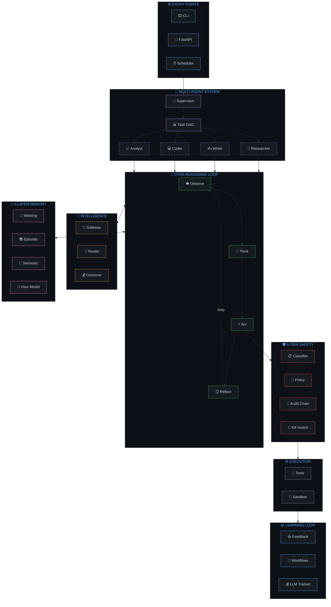
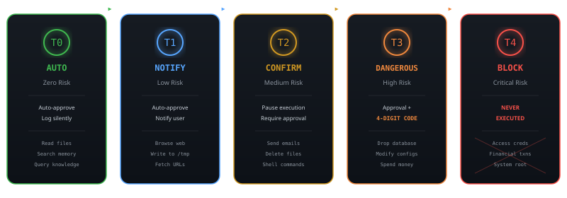
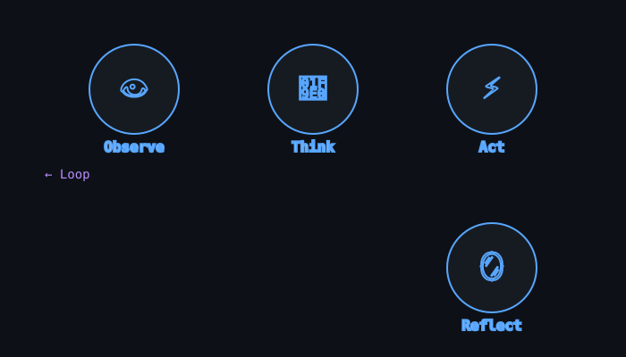
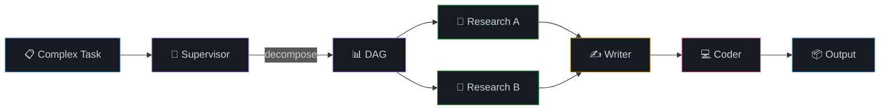
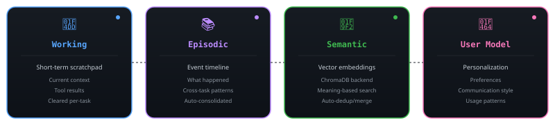
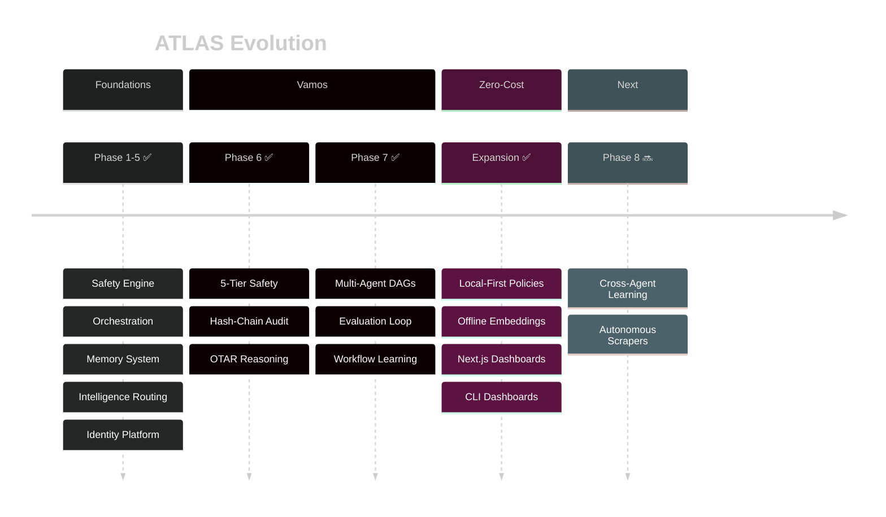

<!-- ╔═══════════════════════════════════════════════════════════════════════════╗ -->
<!-- ║                              A T L A S                                  ║ -->
<!-- ║            Autonomous Task & Learning Agent System                       ║ -->
<!-- ╚═══════════════════════════════════════════════════════════════════════════╝ -->

<!-- Load custom animations and scripts -->
<link rel="stylesheet" href="assets/styles/readme-animations.css">

<div align="center">

<!-- ═══ HERO WITH PARTICLE BACKGROUND ═══ -->
<div class="hero-container" style="position: relative; background: #0d1117; padding: 40px 0;">
  <!-- Particle animation canvas -->
  <canvas id="particles-canvas" width="100%" height="300"></canvas>
  
  <!-- Animated wave header -->
  
</div>

<!-- ═══ ANIMATED TYPING ═══ -->
<a href="https://github.com/aman-bhaskar-codes/ATLAS">
  
</a>

<br/>

<!-- ═══ BADGES — ROW 1: STATUS (with pulse animation on hover) ═══ -->
<p>
  <a href="https://github.com/aman-bhaskar-codes/ATLAS/actions" class="badge-pulse"></a>
  <span data-counter data-target="348"></span>
  <a href="https://python.org" class="badge-pulse"></a>
  <a href="https://docs.astral.sh/uv/" class="badge-pulse"></a>
</p>

<!-- ═══ BADGES — ROW 2: QUALITY ═══ -->
<p>
  <a href="https://github.com/astral-sh/ruff"></a>
  
  
  <a href="LICENSE"></a>
</p>

<!-- ═══ NAVIGATION PILLS ═══ -->
<p>
  <a href="#-what-is-atlas"></a>&nbsp;
  <a href="#-architecture"></a>&nbsp;
  <a href="#%EF%B8%8F-safety-engine"></a>&nbsp;
  <a href="#-otar-reasoning-loop"></a>&nbsp;
  <a href="#-multi-agent-system"></a>&nbsp;
  <a href="#-memory-system"></a>&nbsp;
  <a href="#-quickstart"></a>&nbsp;
  <a href="#-api-reference"></a>
</p>

<!-- ═══ HERO BANNER ═══ -->


</div>

<br/>

<!-- ═══════════════════════════════════════════════════════════════ -->
<!-- ═══ SECTION: OVERVIEW ═══════════════════════════════════════ -->
<!-- ═══════════════════════════════════════════════════════════════ -->


<div align="center">
  
</div>

<br/>

> **ATLAS is not another LLM wrapper.** It is a ground-up, multi-phase autonomous agent runtime that plans, reasons, acts, and *learns* — while never doing anything without your explicit permission.
> 
> 📄 **Latest Update:** ATLAS now supports a fully local **Zero-Cost-First Platform Expansion**. See [ZERO_COST_ARCHITECTURE.md](ZERO_COST_ARCHITECTURE.md) for details on running $0 hardware-first DAGs.

<table>
<tr>
<td width="50%" data-scroll-reveal>

### The Problem

Most AI agent frameworks are either:

&nbsp;&nbsp;🚫&nbsp; **Unsafe** — run tools with no guardrails  
&nbsp;&nbsp;🧸&nbsp; **Toy-grade** — can't handle real multi-step tasks  
&nbsp;&nbsp;🔒&nbsp; **Black boxes** — no audit trail, no transparency

### The ATLAS Solution

A production-grade system with:

&nbsp;&nbsp;✅&nbsp; **5-tier safety** with SHA-256 hash-chain audit  
&nbsp;&nbsp;✅&nbsp; **Multi-agent DAG** decomposition with parallel execution  
&nbsp;&nbsp;✅&nbsp; **OTAR reasoning** — Observe → Think → Act → Reflect  
&nbsp;&nbsp;✅&nbsp; **4-layer memory** with vector search and user modeling  
&nbsp;&nbsp;✅&nbsp; **<span data-counter data-target="348">348</span> tests**, zero mocked business logic

</td>
<td width="50%" data-scroll-reveal>

<div class="terminal-3d" style="background: #161b22; border: 1px solid #30363d; border-radius: 8px; padding: 20px; font-family: 'JetBrains Mono', monospace; transform: perspective(1000px) rotateX(5deg) rotateY(-2deg); box-shadow: 0 25px 50px rgba(0,0,0,0.5), 0 0 0 1px rgba(88,166,255,0.1);">
<div style="display: flex; gap: 8px; margin-bottom: 15px;">
  <div style="width: 12px; height: 12px; border-radius: 50%; background: #f85149;"></div>
  <div style="width: 12px; height: 12px; border-radius: 50%; background: #d29922;"></div>
  <div style="width: 12px; height: 12px; border-radius: 50%; background: #3fb950;"></div>
</div>
<div style="color: #c9d1d9; font-size: 13px; line-height: 1.8;">
<div><span style="color: #58a6ff; font-weight: 600;">$</span> <span style="color: #bc8cff;">atlas run "research quantum"</span></div>
<div style="margin-left: 20px; color: #8b949e;">
  <div style="display: flex; align-items: center; gap: 8px; margin: 5px 0;">
    <span>🧠</span><span>Context: 3 memories</span>
  </div>
  <div style="display: flex; align-items: center; gap: 8px; margin: 5px 0;">
    <span>📋</span><span>Plan: 4 steps</span>
  </div>
  <div style="display: flex; align-items: center; gap: 8px; margin: 5px 0;">
    <span>🔬</span><span>Research: arXiv + Wikipedia</span>
  </div>
  <div style="display: flex; align-items: center; gap: 8px; margin: 5px 0;">
    <span>🛡️</span><span>Safety: Tier 0 (auto)</span>
  </div>
  <div style="display: flex; align-items: center; gap: 8px; margin: 5px 0; color: #3fb950;">
    <span>✅</span><span>Complete in 4.2s</span>
  </div>
</div>
<div style="margin-top: 10px;">
  <span style="color: #58a6ff; font-weight: 600;">$</span>
  <span style="display: inline-block; width: 8px; height: 14px; background: #58a6ff; animation: blink 1s step-end infinite;"></span>
</div>
</div>
</div>

</td>
</tr>
</table>

<br/>

<!-- ═══ LIVE DEMOS SECTION ═══ -->
<div align="center" data-scroll-reveal>
  <h3>🎬 See ATLAS in Action</h3>
  <p><em>Watch the OTAR loop, safety intercepts, and multi-agent orchestration live</em></p>
</div>

<table>
<tr>
<td width="50%" align="center" data-scroll-reveal>
  
  <p><strong>📋 Task Execution</strong><br/><em>Full OTAR loop with live streaming</em></p>
</td>
<td width="50%" align="center" data-scroll-reveal>
  
  <p><strong>🛡️ Safety Intercept</strong><br/><em>Dangerous action → approval flow</em></p>
</td>
</tr>
<tr>
<td width="50%" align="center" data-scroll-reveal>
  
  <p><strong>🤖 Multi-Agent DAG</strong><br/><em>Parallel task decomposition</em></p>
</td>
<td width="50%" align="center" data-scroll-reveal>
  
  <p><strong>🧠 Memory Influence</strong><br/><em>Context shaping decisions</em></p>
</td>
</tr>
</table>

<div align="center">
  <p><em>Note: Demo GIFs are placeholders. See <a href="assets/demos/README.md">assets/demos/README.md</a> for recording instructions.</em></p>
</div>

<!-- ═══════════════════════════════════════════════════════════════ -->
<!-- ═══ SECTION: ARCHITECTURE ═══════════════════════════════════ -->
<!-- ═══════════════════════════════════════════════════════════════ -->


<div align="center">
  
</div>

<br/>

<div align="center">



</div>

<!-- ═══════════════════════════════════════════════════════════════ -->
<!-- ═══ SECTION: SAFETY ENGINE ═══════════════════════════════════ -->
<!-- ═══════════════════════════════════════════════════════════════ -->


<div align="center">
  
  <br/><br/>
  <em>"Every action flows through the safety engine. No exceptions. No bypasses."</em>
</div>

<br/>

<div align="center">
  
</div>

<br/>

<details>
<summary><kbd>🔗 Hash-Chain Audit — Tamper-proof logging</kbd></summary>
<br/>

Every audit record includes a SHA-256 hash chain:

```
Row N:  row_hash = SHA256(prev_hash + action + payload + timestamp)
Row N+1: prev_hash = row_hash of Row N
```

If **any** historical record is tampered with, the chain breaks. Verify instantly:

```bash
curl http://localhost:8730/api/v1/audit/verify
# → {"chain_valid": true, "records_verified": 1847, "status": "✓ Audit chain intact"}
```

</details>

<details>
<summary><kbd>⚙️ Confirmation Code — DANGEROUS tier protection</kbd></summary>
<br/>

Tier 3 (DANGEROUS) actions require a randomly-generated **4-digit confirmation code** on top of explicit user approval:

```
⚠️  DANGEROUS ACTION DETECTED
    Action: database.drop_table("users")
    Tier: 3 (DANGEROUS)

    Enter confirmation code [4729] to proceed: _
```

This prevents accidental approvals of high-impact operations.

</details>

<!-- ═══════════════════════════════════════════════════════════════ -->
<!-- ═══ SECTION: OTAR LOOP ══════════════════════════════════════ -->
<!-- ═══════════════════════════════════════════════════════════════ -->


<div align="center">
  
</div>

<br/>

Every agent iteration follows the **Observe → Think → Act → Reflect** cycle. This isn't just ReAct — the explicit Reflect step evaluates outcomes and prevents repeating mistakes.

<div align="center" data-scroll-reveal>
  
  <p><em>Animated OTAR cycle — watch the flow progress through each phase</em></p>
</div>

<br/>

<details>
<summary><kbd>🪞 What does Reflect actually do?</kbd></summary>
<br/>

After every action, the Reflect step produces a `ReflectionResult`:

```python
@dataclass(frozen=True)
class ReflectionResult:
    succeeded: bool                    # Did the action achieve its goal?
    learnings: list[str]               # What did we learn? (errors, side effects)
    should_adjust_plan: bool           # Should we change course?
    adjustment_reason: str | None      # Why?
```

This means the agent:
- **Never silently ignores failures** — errors are captured as learnings
- **Knows when to pivot** — `should_adjust_plan` triggers replanning
- **Builds context** — learnings feed into the next Observe step

</details>

<details>
<summary><kbd>🔎 Pre-Action Self-Critique</kbd></summary>
<br/>

Before any consequential action hits the Safety Engine, the agent runs a **fast, cheap self-critique** to catch obvious mistakes:

```
Critique Verdicts:
  ✅ OK     → proceed (tier unchanged — Safety Engine still gates it)
  ✏️ REVISE → regenerate the action once with the concern in mind
  🛑 ABORT  → convert to ask_user ("I held off because...")
```

This catches ~15% of risky actions before they even reach the safety classifier, saving both tokens and user interruptions.

</details>

<!-- ═══════════════════════════════════════════════════════════════ -->
<!-- ═══ SECTION: MULTI-AGENT ════════════════════════════════════ -->
<!-- ═══════════════════════════════════════════════════════════════ -->


<div align="center">
  
</div>

<br/>

Complex tasks are decomposed by the **Supervisor** into a **directed acyclic graph (DAG)**. Independent subtasks run in **parallel**; dependent ones wait.

<div align="center">



</div>

<details>
<summary><kbd>🔬 Specialist Agent Profiles</kbd></summary>
<br/>

| Agent | Role | Tools | Temp |
|-------|------|-------|------|
| 🔬 **Researcher** | Find, analyze, synthesize information | `browser` `knowledge` `memory` `http` | 0.1 |
| ✍️ **Writer** | Compose, edit, refine text | `filesystem` `knowledge` `memory` | 0.4 |
| 💻 **Coder** | Production-quality code | `filesystem` `shell` `code` `knowledge` | 0.1 |
| 📈 **Analyst** | Data patterns, actionable insights | `filesystem` `shell` `code` `knowledge` | 0.1 |
| 🌐 **General** | Fallback for unclassified tasks | `filesystem` `shell` `browser` `knowledge` `memory` | 0.2 |

Each specialist has **its own system prompt, tool permissions, and model preferences**. The Supervisor chooses the right specialist for each subtask based on the decomposition.

</details>

<!-- ═══════════════════════════════════════════════════════════════ -->
<!-- ═══ SECTION: MEMORY ═════════════════════════════════════════ -->
<!-- ═══════════════════════════════════════════════════════════════ -->


<div align="center">
  
</div>

<br/>

<div align="center">
  
</div>

<!-- ═══════════════════════════════════════════════════════════════ -->
<!-- ═══ SECTION: COMPARISON ═════════════════════════════════════ -->
<!-- ═══════════════════════════════════════════════════════════════ -->


<div align="center">
  
  <p><em>Production-grade safety and transparency vs. existing frameworks</em></p>
</div>

<br/>

<table data-scroll-reveal>
<tr style="background: #161b22;">
  <th align="left" width="35%">Feature</th>
  <th align="center" width="16%">ATLAS</th>
  <th align="center" width="16%">AutoGPT</th>
  <th align="center" width="16%">LangChain</th>
  <th align="center" width="16%">CrewAI</th>
</tr>
<tr class="atlas-row" style="background: linear-gradient(90deg, rgba(210, 153, 34, 0.1) 0%, rgba(210, 153, 34, 0.05) 100%);">
  <td><strong>🛡️ 5-Tier Safety System</strong></td>
  <td align="center"><span class="checkmark" style="color: #3fb950; font-size: 20px;">✅</span></td>
  <td align="center"><span class="x-mark" style="color: #f85149; font-size: 18px;">❌</span></td>
  <td align="center"><span class="x-mark" style="color: #f85149; font-size: 18px;">❌</span></td>
  <td align="center" style="color: #d29922;">⚠️</td>
</tr>
<tr class="comparison-row atlas-row">
  <td><strong>🔗 Hash-Chain Audit Log</strong></td>
  <td align="center"><span class="checkmark" style="color: #3fb950; font-size: 20px;">✅</span></td>
  <td align="center"><span class="x-mark" style="color: #f85149; font-size: 18px;">❌</span></td>
  <td align="center"><span class="x-mark" style="color: #f85149; font-size: 18px;">❌</span></td>
  <td align="center"><span class="x-mark" style="color: #f85149; font-size: 18px;">❌</span></td>
</tr>
<tr class="comparison-row atlas-row">
  <td><strong>🔄 OTAR Reasoning Loop</strong></td>
  <td align="center"><span class="checkmark" style="color: #3fb950; font-size: 20px;">✅</span></td>
  <td align="center" style="color: #d29922;">⚠️ ReAct</td>
  <td align="center" style="color: #d29922;">⚠️ ReAct</td>
  <td align="center"><span class="x-mark" style="color: #f85149; font-size: 18px;">❌</span></td>
</tr>
<tr class="comparison-row atlas-row">
  <td><strong>📊 Multi-Agent DAGs</strong></td>
  <td align="center"><span class="checkmark" style="color: #3fb950; font-size: 20px;">✅</span></td>
  <td align="center" style="color: #d29922;">⚠️ Basic</td>
  <td align="center"><span class="x-mark" style="color: #f85149; font-size: 18px;">❌</span></td>
  <td align="center"><span class="checkmark" style="color: #3fb950; font-size: 20px;">✅</span></td>
</tr>
<tr class="comparison-row atlas-row">
  <td><strong>🧠 4-Layer Memory System</strong></td>
  <td align="center"><span class="checkmark" style="color: #3fb950; font-size: 20px;">✅</span></td>
  <td align="center" style="color: #d29922;">⚠️ Basic</td>
  <td align="center" style="color: #d29922;">⚠️ Vector only</td>
  <td align="center"><span class="x-mark" style="color: #f85149; font-size: 18px;">❌</span></td>
</tr>
<tr class="comparison-row atlas-row">
  <td><strong>📈 Evaluation & Learning Loop</strong></td>
  <td align="center"><span class="checkmark" style="color: #3fb950; font-size: 20px;">✅</span></td>
  <td align="center"><span class="x-mark" style="color: #f85149; font-size: 18px;">❌</span></td>
  <td align="center"><span class="x-mark" style="color: #f85149; font-size: 18px;">❌</span></td>
  <td align="center"><span class="x-mark" style="color: #f85149; font-size: 18px;">❌</span></td>
</tr>
<tr class="comparison-row atlas-row">
  <td><strong>🔴 Production-Ready Tests</strong></td>
  <td align="center"><span class="checkmark" style="color: #3fb950; font-size: 20px;">✅</span> 348</td>
  <td align="center" style="color: #d29922;">⚠️ Limited</td>
  <td align="center"><span class="checkmark" style="color: #3fb950; font-size: 20px;">✅</span></td>
  <td align="center" style="color: #d29922;">⚠️ Limited</td>
</tr>
<tr class="comparison-row atlas-row">
  <td><strong>💰 Cost Tracking & Governance</strong></td>
  <td align="center"><span class="checkmark" style="color: #3fb950; font-size: 20px;">✅</span></td>
  <td align="center"><span class="x-mark" style="color: #f85149; font-size: 18px;">❌</span></td>
  <td align="center" style="color: #d29922;">⚠️ Basic</td>
  <td align="center"><span class="x-mark" style="color: #f85149; font-size: 18px;">❌</span></td>
</tr>
</table>

<br/>

<div align="center">
  <p style="color: #8b949e; font-style: italic;">
    ✅ Full support • ⚠️ Partial/Basic • ❌ Not available
  </p>
</div>

<!-- ═══════════════════════════════════════════════════════════════ -->
<!-- ═══ SECTION: QUICKSTART ═════════════════════════════════════ -->
<!-- ═══════════════════════════════════════════════════════════════ -->


<div align="center">
  
</div>

<br/>

<table>
<tr>
<td></td>
<td></td>
<td></td>
</tr>
</table>

```bash
# 1. Clone & install
git clone https://github.com/aman-bhaskar-codes/ATLAS.git
cd ATLAS/atlas
uv sync --all-extras

# 2. Configure
cp .env.example .env
# Edit .env → set OLLAMA_HOST, optional cloud API keys

# 3. Health check
uv run atlas doctor

# 4. Run your first task
uv run atlas run "research the latest papers on multi-agent systems and save a summary"
```

<details>
<summary><kbd>💻 Web Dashboard</kbd></summary>
<br/>

ATLAS includes a real-time Next.js dashboard for monitoring agent reasoning, approvals, and memories:

```bash
# Terminal 1: Backend API
uv run uvicorn atlas.interfaces.api.app:create_app --factory --host 127.0.0.1 --port 8730 --reload

# Terminal 2: Frontend
cd frontend && npm install && npm run dev
```

Open **[http://localhost:3000](http://localhost:3000)** → live agent tracking dashboard.

</details>

<!-- ═══════════════════════════════════════════════════════════════ -->
<!-- ═══ SECTION: API ════════════════════════════════════════════ -->
<!-- ═══════════════════════════════════════════════════════════════ -->


<div align="center">
  
</div>

<br/>

<details>
<summary><kbd>📋 Tasks & Execution</kbd></summary>
<br/>

| Method | Endpoint | Description |
|--------|----------|-------------|
| `POST` | `/api/v1/tasks` | Submit a new task |
| `POST` | `/api/v1/tasks/{id}/cancel` | Cancel a running task |
| `GET` | `/api/v1/tasks/{id}/events` | SSE event stream |

</details>

<details>
<summary><kbd>🛡️ Safety & Approvals</kbd></summary>
<br/>

| Method | Endpoint | Description |
|--------|----------|-------------|
| `GET` | `/api/v1/approvals/pending` | Pending approval queue |
| `POST` | `/api/v1/approvals/{id}/decide` | Approve or deny |
| `GET` | `/api/v1/audit/verify` | Verify hash chain |

</details>

<details>
<summary><kbd>📊 Feedback & Evaluation</kbd></summary>
<br/>

| Method | Endpoint | Description |
|--------|----------|-------------|
| `POST` | `/api/v1/feedback` | Submit rating + optional edit |
| `GET` | `/api/v1/feedback/stats` | Aggregate stats |
| `GET` | `/api/v1/schedules` | List cron schedules |
| `POST` | `/api/v1/schedules` | Create recurring task |

</details>

<details>
<summary><kbd>🧠 Memory & Knowledge</kbd></summary>
<br/>

| Method | Endpoint | Description |
|--------|----------|-------------|
| `GET` | `/api/v1/memory/search` | Semantic search |
| `POST` | `/api/v1/memory/store` | Store entry |
| `GET` | `/api/v1/capabilities` | List capabilities |

</details>

<!-- ═══════════════════════════════════════════════════════════════ -->
<!-- ═══ SECTION: PROJECT STRUCTURE ══════════════════════════════ -->
<!-- ═══════════════════════════════════════════════════════════════ -->


<div align="center">
  
</div>

<br/>

<details>
<summary><kbd>Click to expand full project tree</kbd></summary>

```
atlas/
├── config/                          # ⚙️ Configuration
│   ├── models.yaml                  #    Model registry (providers, costs, limits)
│   ├── permissions.yaml             #    5-tier safety rules per tool
│   └── settings.yaml                #    Runtime settings
│
├── src/atlas/
│   ├── agents/                      # 🤖 Multi-Agent System
│   │   ├── base.py                  #    BaseAgent protocol + AgentConfig
│   │   ├── dag.py                   #    TaskDAG with topological batching
│   │   ├── registry.py              #    Lazy agent factory registry
│   │   ├── specialists.py           #    5 specialist agent configs
│   │   └── supervisor.py            #    Decompose → orchestrate → synthesize
│   │
│   ├── capabilities/                # 🔧 Tool Implementations
│   │   ├── browser/                 #    Browser automation (Playwright)
│   │   ├── identity/                #    Identity, auth, secret store
│   │   ├── notification/            #    Push, email, SMS notifications
│   │   └── platforms/               #    Email, calendar, contacts, knowledge
│   │
│   ├── infra/                       # 🏗️ Infrastructure Layer
│   │   ├── db.py                    #    SQLite + auto-migrations
│   │   ├── feedback.py              #    User feedback store
│   │   ├── llm_tracker.py           #    Per-model/per-task cost tracking
│   │   ├── scheduler.py             #    Cron scheduler (5-field expressions)
│   │   ├── types.py                 #    Shared contracts (Tier enum)
│   │   └── workflows.py             #    Learned workflow templates
│   │
│   ├── intelligence/                # 🧪 Model Gateway & Routing
│   │   ├── gateway.py               #    Multi-provider LLM gateway
│   │   ├── governance/              #    Cost governor, budgets, limits
│   │   └── selection/               #    Model selector, capability router
│   │
│   ├── interfaces/                  # 🌐 API & CLI
│   │   └── api/                     #    FastAPI routes, SSE, schemas
│   │
│   ├── memory/                      # 🧠 4-Layer Memory
│   │   ├── episodic.py              #    Event timeline
│   │   ├── semantic.py              #    Vector embeddings (ChromaDB)
│   │   ├── working.py              #    Per-task scratchpad
│   │   └── user_model.py            #    Preference learning
│   │
│   ├── orchestration/               # 🔄 OTAR Runtime
│   │   ├── reasoning.py             #    OTAR reasoning loop
│   │   ├── reflection.py            #    Post-action Reflect step
│   │   ├── self_critique.py         #    Pre-action self-critique
│   │   └── planner.py              #    LLM-powered plan generation
│   │
│   ├── safety/                      # 🛡️ Safety Engine
│   │   ├── audit.py                 #    SHA-256 hash-chain audit log
│   │   ├── classifier.py            #    5-tier action classifier
│   │   ├── engine.py                #    Reference monitor (deny-by-default)
│   │   └── policy.py               #    Policy chain + kill switch
│   │
│   └── app.py                       # 🎯 Composition root (all DI wiring)
│
├── tests/                           # ✅ 348 collected tests
├── frontend/                        # 💻 Next.js dashboard
└── pyproject.toml                   # 📦 Project configuration
```

</details>

<!-- ═══════════════════════════════════════════════════════════════ -->
<!-- ═══ SECTION: TESTING ════════════════════════════════════════ -->
<!-- ═══════════════════════════════════════════════════════════════ -->


<div align="center">
  
</div>

<br/>

```bash
uv run pytest                  # Full suite (348 tests)
uv run pytest -v               # Verbose output
uv run ruff check .            # Linter
uv run mypy                    # Type checking (strict)
```

<!-- ═══════════════════════════════════════════════════════════════ -->
<!-- ═══ SECTION: ROADMAP ════════════════════════════════════════ -->
<!-- ═══════════════════════════════════════════════════════════════ -->


<div align="center">
  
</div>

<br/>



<!-- ═══════════════════════════════════════════════════════════════ -->
<!-- ═══ SECTION: CONTRIBUTING ═══════════════════════════════════ -->
<!-- ═══════════════════════════════════════════════════════════════ -->


<div align="center">
  
</div>

<br/>

Contributions are welcome! Please read the contributing guidelines before submitting a PR.

```bash
# 1. Fork & clone
git clone https://github.com/YOUR_USERNAME/ATLAS.git

# 2. Create feature branch
git checkout -b feat/amazing-feature

# 3. Make changes & test
uv run pytest

# 4. Commit & push
git commit -m "feat: add amazing feature"
git push origin feat/amazing-feature

# 5. Open a Pull Request
```

<!-- ═══════════════════════════════════════════════════════════════ -->
<!-- ═══ SECTION: LICENSE ════════════════════════════════════════ -->
<!-- ═══════════════════════════════════════════════════════════════ -->


<div align="center">

### 📜 License

This project is licensed under the **MIT License** — see the [LICENSE](LICENSE) file for details.

<br/>

<!-- ═══ ANIMATED WAVE FOOTER ═══ -->


<br/>


<br/>

<a href="https://github.com/aman-bhaskar-codes"></a>

</div>


<!-- ═══════════════════════════════════════════════════════════════ -->
<!-- ═══ ANIMATION SCRIPTS ═══════════════════════════════════════ -->
<!-- ═══════════════════════════════════════════════════════════════ -->

<!-- Load animation scripts -->
<script src="assets/scripts/particles.js" defer></script>
<script src="assets/scripts/counter.js" defer></script>
<script src="assets/scripts/scroll-reveal.js" defer></script>
<script src="assets/scripts/diagram-interactive.js" defer></script>

<!-- Inline blink animation for cursor -->
<style>
@keyframes blink {
  0%, 100% { opacity: 1; }
  50% { opacity: 0; }
}
</style>
