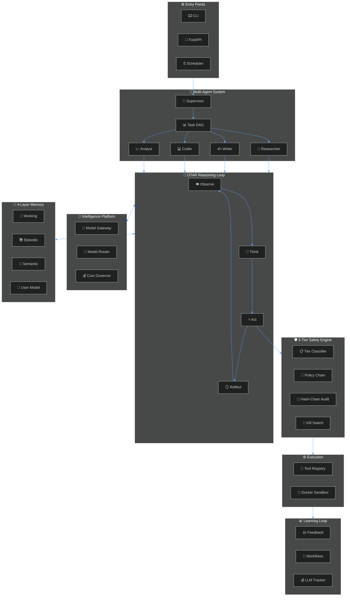
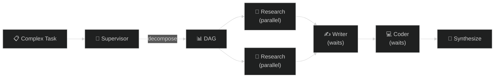

<!-- ╔═══════════════════════════════════════════════════════════════════════════╗ -->
<!-- ║                              ATLAS README                               ║ -->
<!-- ║            Autonomous Task & Learning Agent System                       ║ -->
<!-- ╚═══════════════════════════════════════════════════════════════════════════╝ -->

<div align="center">

<!-- ═══ ANIMATED CAPSULE HEADER ═══ -->


<!-- ═══ ANIMATED TYPING ═══ -->
<a href="https://github.com/aman-bhaskar-codes/ATLAS">
  
</a>

<br/>

<!-- ═══ ANIMATED BADGES ═══ -->
<p>
  <a href="https://github.com/aman-bhaskar-codes/ATLAS/actions"></a>
  <a href="https://python.org"></a>
  <a href="https://docs.astral.sh/uv/"></a>
  <a href="https://github.com/astral-sh/ruff"></a>
  <a href="LICENSE"></a>
</p>

<p>
  <a href="#-quickstart"></a>
  <a href="#-architecture"></a>
  <a href="#-safety-engine"></a>
  <a href="#-multi-agent-system"></a>
  <a href="#-api-reference"></a>
</p>

<!-- ═══ HERO BANNER ═══ -->


<br/><br/>

</div>

<!-- ═══ GRADIENT DIVIDER ═══ -->


## 🌌 What is ATLAS?

> **ATLAS is not another LLM wrapper.** It is a ground-up, multi-phase autonomous agent runtime that plans, reasons, acts, and learns — while never doing anything without your explicit permission.

<table>
<tr>
<td width="50%">

### The Problem
Most AI agent frameworks are either:
- 🚫 **Unsafe** — run tools with no guardrails
- 🧸 **Toy-grade** — can't handle real multi-step tasks
- 🔒 **Black boxes** — no audit trail, no transparency

### The ATLAS Solution
A production-grade system with:
- ✅ **5-tier safety** with confirmation codes
- ✅ **Tamper-proof audit chain** (SHA-256)
- ✅ **Multi-agent DAG** decomposition
- ✅ **OTAR reasoning** (Observe → Think → Act → Reflect)
- ✅ **140+ tests**, zero mocked business logic

</td>
<td width="50%">

```text
╔══════════════════════════════════════╗
║         ATLAS Runtime Flow           ║
╠══════════════════════════════════════╣
║                                      ║
║   📥 Task Intake                     ║
║    ↓                                 ║
║   🧠 Memory Retrieval               ║
║    ↓                                 ║
║   📋 Plan Generation                ║
║    ↓                                 ║
║   🔄 OTAR Loop ──────────────┐      ║
║    │  Observe                 │      ║
║    │  Think                   │      ║
║    │  Act → 🛡️ Safety Gate   │      ║
║    │  Reflect                 │      ║
║    └──────────────────────────┘      ║
║    ↓                                 ║
║   📊 Evaluation & Learning          ║
║                                      ║
╚══════════════════════════════════════╝
```

</td>
</tr>
</table>


## 🏗️ Architecture

<div align="center">



</div>


## 🛡️ Safety Engine

<div align="center">

> *"Nothing executes without flowing through the safety engine. Period."*

</div>

ATLAS uses a **5-tier, deny-by-default** classification system. Every tool call is classified before execution, and the entire audit log is protected by a **SHA-256 hash chain** — making it cryptographically tamper-proof.

<table>
<tr>
<th>Tier</th>
<th>Name</th>
<th>Risk</th>
<th>Behavior</th>
<th>Example</th>
</tr>
<tr>
<td><code>0</code></td>
<td><strong>🟢 AUTO</strong></td>
<td>None</td>
<td>Auto-approve, log silently</td>
<td>Read a file, search memory</td>
</tr>
<tr>
<td><code>1</code></td>
<td><strong>🔵 NOTIFY</strong></td>
<td>Low</td>
<td>Auto-approve with notification</td>
<td>Navigate browser, write to allowed path</td>
</tr>
<tr>
<td><code>2</code></td>
<td><strong>🟡 CONFIRM</strong></td>
<td>Medium</td>
<td>Require explicit user approval</td>
<td>Send email, delete file, run shell command</td>
</tr>
<tr>
<td><code>3</code></td>
<td><strong>🟠 DANGEROUS</strong></td>
<td>High</td>
<td>Approval + 4-digit confirmation code</td>
<td>Drop database, modify config, spend money</td>
</tr>
<tr>
<td><code>4</code></td>
<td><strong>🔴 BLOCK</strong></td>
<td>Critical</td>
<td>Never executed</td>
<td>Access credentials, financial transactions</td>
</tr>
</table>

<details>
<summary><strong>🔗 Hash-Chain Audit (click to expand)</strong></summary>
<br/>

Every audit record includes:
- `prev_hash` — SHA-256 of the previous record
- `row_hash` — SHA-256(prev_hash + action + payload + timestamp)

If **any** historical record is modified, the chain breaks. Verify integrity with:

```bash
# API endpoint
curl http://localhost:8730/api/v1/audit/verify

# Response
{
  "chain_valid": true,
  "records_verified": 1847,
  "status": "✓ Audit chain intact"
}
```

</details>


## 🤖 Multi-Agent System

Complex tasks are automatically decomposed by the **Supervisor Agent** into a **directed acyclic graph (DAG)** of subtasks. Independent subtasks execute in **parallel**, while dependent ones wait.

<div align="center">



</div>

<table>
<tr>
<th>Agent</th>
<th>Role</th>
<th>Allowed Tools</th>
</tr>
<tr><td>🔬 <strong>Researcher</strong></td><td>Find, analyze, synthesize information</td><td><code>browser</code> <code>knowledge</code> <code>memory</code> <code>http</code></td></tr>
<tr><td>✍️ <strong>Writer</strong></td><td>Compose, edit, refine text</td><td><code>filesystem</code> <code>knowledge</code> <code>memory</code></td></tr>
<tr><td>💻 <strong>Coder</strong></td><td>Write production-quality code</td><td><code>filesystem</code> <code>shell</code> <code>code</code> <code>knowledge</code></td></tr>
<tr><td>📈 <strong>Analyst</strong></td><td>Data analysis, pattern recognition</td><td><code>filesystem</code> <code>shell</code> <code>code</code> <code>knowledge</code></td></tr>
<tr><td>🌐 <strong>General</strong></td><td>Fallback for unclassified tasks</td><td><code>filesystem</code> <code>shell</code> <code>browser</code> <code>knowledge</code> <code>memory</code></td></tr>
</table>


## 🔄 OTAR Reasoning Loop

Every agent iteration follows the **Observe → Think → Act → Reflect** cycle:

```
┌─────────────────────────────────────────────────────────────┐
│                                                             │
│   ┌──────────┐    ┌──────────┐    ┌──────────┐    ┌─────┐ │
│   │ OBSERVE  │───▶│  THINK   │───▶│   ACT    │───▶│  R  │ │
│   │          │    │          │    │          │    │  E  │ │
│   │ Retrieve │    │ Reason   │    │ Execute  │    │  F  │ │
│   │ context  │    │ over     │    │ through  │    │  L  │ │
│   │ + memory │    │ options  │    │ safety   │    │  E  │ │
│   │          │    │          │    │ engine   │    │  C  │ │
│   └──────────┘    └──────────┘    └──────────┘    │  T  │ │
│        ▲                                          │     │ │
│        └──────────────────────────────────────────┘     │ │
│                     loop until done                      │ │
└─────────────────────────────────────────────────────────────┘
```

<details>
<summary><strong>🪞 What does Reflect do? (click to expand)</strong></summary>
<br/>

After every action, the agent evaluates:
- **Did the action succeed?** → track in `ReflectionResult`
- **What did we learn?** → extract error messages, side effects
- **Should we adjust the plan?** → flag `should_adjust_plan` if the action failed

This prevents the agent from repeating the same mistakes.

</details>


## 🧠 Memory System

<table>
<tr>
<td align="center" width="25%">
<h3>📝</h3>
<strong>Working Memory</strong>
<br/><br/>
Short-term scratchpad. Cleared per-task. Holds current context, tool results, and intermediate thoughts.
</td>
<td align="center" width="25%">
<h3>📚</h3>
<strong>Episodic Memory</strong>
<br/><br/>
Event log. Stores what happened, when, and how it turned out. Enables pattern recognition across tasks.
</td>
<td align="center" width="25%">
<h3>🧲</h3>
<strong>Semantic Memory</strong>
<br/><br/>
Vector embeddings via ChromaDB. Retrieves knowledge by meaning, not keywords. Auto-consolidates similar entries.
</td>
<td align="center" width="25%">
<h3>👤</h3>
<strong>User Model</strong>
<br/><br/>
Learns your preferences, communication style, and frequently used patterns to personalize responses.
</td>
</tr>
</table>


## 🚀 Quickstart

### Prerequisites

<table>
<tr>
<td></td>
<td></td>
<td></td>
</tr>
</table>

### 1️⃣ Install

```bash
git clone https://github.com/aman-bhaskar-codes/ATLAS.git
cd ATLAS/atlas
uv sync --all-extras
```

### 2️⃣ Configure

```bash
cp .env.example .env
# Edit .env — set OLLAMA_HOST, add any cloud API keys
```

### 3️⃣ Verify

```bash
uv run atlas doctor        # preflight health check
```

### 4️⃣ Run

```bash
# Dispatch a task to your autonomous agent
uv run atlas run "research the latest papers on multi-agent systems and save the summary"
```


## 💻 Web Dashboard

ATLAS includes a real-time Next.js dashboard for monitoring agent reasoning, approvals, and memories.

```bash
# Terminal 1: Backend
uv run uvicorn atlas.interfaces.api.app:create_app --factory --host 127.0.0.1 --port 8730 --reload

# Terminal 2: Frontend
cd frontend && npm install && npm run dev
```

Open **[http://localhost:3000](http://localhost:3000)** → live agent tracking dashboard.


## 📡 API Reference

<details>
<summary><strong>Tasks & Execution</strong></summary>
<br/>

| Method | Endpoint | Description |
|--------|----------|-------------|
| `POST` | `/api/v1/tasks` | Submit a new task |
| `POST` | `/api/v1/tasks/{id}/cancel` | Cancel a running task |
| `GET` | `/api/v1/tasks/{id}/events` | SSE event stream for task |

</details>

<details>
<summary><strong>Safety & Approvals</strong></summary>
<br/>

| Method | Endpoint | Description |
|--------|----------|-------------|
| `GET` | `/api/v1/approvals/pending` | List pending approvals |
| `POST` | `/api/v1/approvals/{id}/decide` | Approve/deny an action |
| `GET` | `/api/v1/audit/verify` | Verify hash chain integrity |

</details>

<details>
<summary><strong>Feedback & Evaluation</strong></summary>
<br/>

| Method | Endpoint | Description |
|--------|----------|-------------|
| `POST` | `/api/v1/feedback` | Submit thumbs up/down + optional edit |
| `GET` | `/api/v1/feedback/stats` | Aggregate feedback statistics |
| `GET` | `/api/v1/schedules` | List recurring schedules |
| `POST` | `/api/v1/schedules` | Create a cron schedule |

</details>

<details>
<summary><strong>Memory & Knowledge</strong></summary>
<br/>

| Method | Endpoint | Description |
|--------|----------|-------------|
| `GET` | `/api/v1/memory/search` | Semantic memory search |
| `POST` | `/api/v1/memory/store` | Store a memory entry |
| `GET` | `/api/v1/capabilities` | List registered capabilities |

</details>


## 📁 Project Structure

<details>
<summary><strong>Click to expand full project tree</strong></summary>

```
atlas/
├── config/                     # Configuration files
│   ├── models.yaml             # Model registry (providers, costs)
│   ├── permissions.yaml        # 5-tier safety rules
│   └── settings.yaml           # Runtime settings
├── src/atlas/
│   ├── agents/                 # 🤖 Multi-Agent System
│   │   ├── base.py             # BaseAgent + AgentConfig
│   │   ├── dag.py              # TaskDAG + topological sort
│   │   ├── registry.py         # Agent registry
│   │   ├── specialists.py      # 5 specialist agents
│   │   └── supervisor.py       # Supervisor decomposition
│   ├── capabilities/           # 🔧 Tool implementations
│   │   ├── browser/            # Browser automation
│   │   ├── identity/           # Identity & auth
│   │   ├── notification/       # Push/email notifications
│   │   └── platforms/          # Email, calendar, contacts
│   ├── infra/                  # 🏗️ Infrastructure
│   │   ├── db.py               # SQLite + migrations
│   │   ├── feedback.py         # Feedback store
│   │   ├── llm_tracker.py      # LLM cost tracking
│   │   ├── scheduler.py        # Cron scheduler
│   │   ├── types.py            # Shared contracts (5-tier)
│   │   └── workflows.py        # Workflow templates
│   ├── intelligence/           # 🧪 Model gateway & routing
│   │   ├── gateway.py          # Multi-provider LLM gateway
│   │   ├── governance/         # Cost governor, budgets
│   │   └── selection/          # Model selector, router
│   ├── interfaces/             # 🌐 API & CLI
│   │   └── api/                # FastAPI routes
│   ├── memory/                 # 🧠 4-layer memory
│   │   ├── episodic.py         # Event log
│   │   ├── semantic.py         # Vector embeddings
│   │   ├── working.py          # Task scratchpad
│   │   └── user_model.py       # User preferences
│   ├── orchestration/          # 🔄 OTAR runtime
│   │   ├── reasoning.py        # OTAR reasoning loop
│   │   ├── reflection.py       # Reflect step
│   │   ├── self_critique.py    # Pre-action critique
│   │   └── planner.py          # Plan generation
│   ├── safety/                 # 🛡️ Safety engine
│   │   ├── audit.py            # Hash-chain audit log
│   │   ├── classifier.py       # 5-tier classifier
│   │   ├── engine.py           # Safety engine (reference monitor)
│   │   └── policy.py           # Policy chain
│   └── app.py                  # 🎯 Composition root
├── tests/                      # 140+ tests
├── frontend/                   # Next.js dashboard
└── pyproject.toml              # Project config
```

</details>


## 🧪 Testing

```bash
# Full test suite (140+ tests)
uv run pytest

# With verbose output
uv run pytest -v

# Linter and type checking
uv run ruff check .
uv run mypy
```


## 🗺️ Roadmap

<table>
<tr>
<td>✅</td>
<td><strong>Phase 1–5</strong></td>
<td>Safety Engine, Orchestration, Memory, Intelligence Routing, Identity Platform</td>
</tr>
<tr>
<td>✅</td>
<td><strong>Phase 6</strong></td>
<td>5-Tier Safety + SHA-256 Hash-Chain Audit, OTAR Reasoning Loop</td>
</tr>
<tr>
<td>✅</td>
<td><strong>Phase 7</strong></td>
<td>Multi-Agent DAG System, Evaluation Loop, Feedback Store, LLM Tracker, Workflow Templates</td>
</tr>
<tr>
<td>🔜</td>
<td><strong>Phase 8</strong></td>
<td>RAG Pipeline Integration, Earned Autonomy Levels</td>
</tr>
<tr>
<td>🔮</td>
<td><strong>Phase 9</strong></td>
<td>Peer-Review Agent Swarms, Cross-Agent Learning</td>
</tr>
<tr>
<td>🔮</td>
<td><strong>Phase 10</strong></td>
<td>Voice Interface, Mobile Companion, Plugin Marketplace</td>
</tr>
</table>


## 🤝 Contributing

Contributions are welcome! Please read the contributing guidelines before submitting a PR.

1. Fork the repo
2. Create your feature branch (`git checkout -b feat/amazing-feature`)
3. Run tests (`uv run pytest`)
4. Commit your changes (`git commit -m 'feat: add amazing feature'`)
5. Push to the branch (`git push origin feat/amazing-feature`)
6. Open a Pull Request


## 📜 License

This project is licensed under the **MIT License** — see the [LICENSE](LICENSE) file for details.

<br/>

<!-- ═══ ANIMATED FOOTER ═══ -->
<div align="center">


<br/>


<br/>

<a href="https://github.com/aman-bhaskar-codes"></a>

</div>
