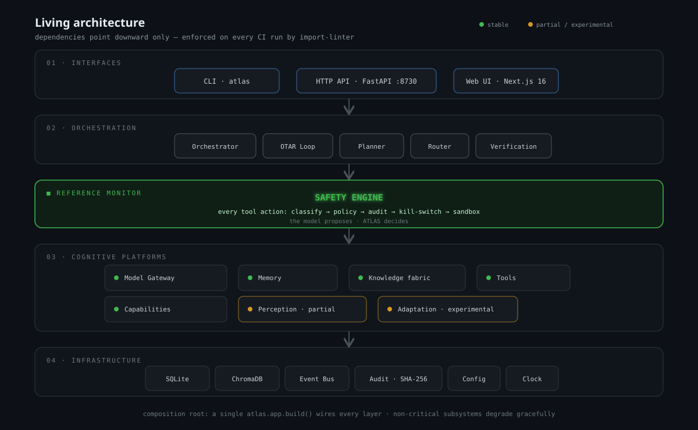
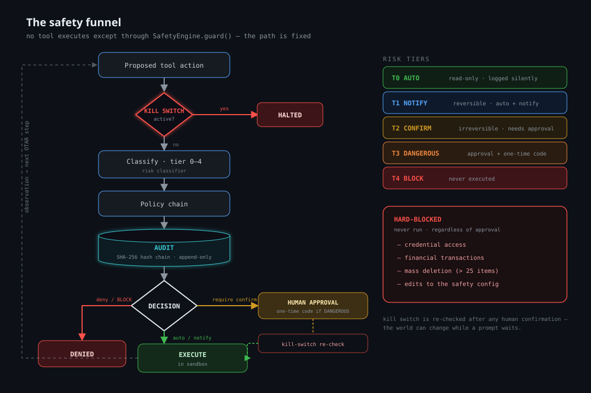

<!--
  ATLAS README — regenerated 2026-08-29 directly against the live tree.
  Every number, path, flag and command below was verified from source, not
  from memory. Motion graphics are self-hosted animated SVGs (no third-party
  badge/animation services), each paired with a prefers-reduced-motion
  static fallback via <picture>.
-->

<div align="center">

<picture>
  <source media="(prefers-reduced-motion: reduce)" srcset="assets/readme/motion/atlas-titlecard-static.svg">
  
</picture>

<br/>

[](pyproject.toml)
[](tests)
[](pyproject.toml)
[](config/models.yaml)
[](config/settings.yaml)
[](src/atlas/safety)
[](importlinter.ini)
[](LICENSE)

**[What it is](#what-atlas-is)** · **[Pipeline](#the-pipeline-one-funnel-no-bypasses)** · **[Architecture](#architecture)** · **[Safety](#safety-the-part-that-says-no)** · **[Memory](#memory--two-lane-recall)** · **[Models](#intelligence--cost)** · **[Voice](#voice)** · **[Quick start](#quick-start)** · **[Config](#configuration)** · **[Status](#current-status-honest-version)**

</div>


## What ATLAS is

ATLAS is a **personal autonomous agent runtime** that runs on your machine, spends
nothing to think, and cannot take a consequential action without passing a
deny-by-default safety gate that writes a tamper-evident record of what it did.

It is one process, one composition root, one funnel. A request arriving from the
CLI, the HTTP API, a WebSocket, a cron automation or a spoken sentence lands in the
*same* orchestrator, gets classified into the *same* five-tier risk ladder, and is
executed through the *same* sandboxed tool registry. There is no side door — that
property is enforced by an import-linter contract, not by convention.

What it is **not**: a chat wrapper, a prompt-template collection, or a hosted
service. There is no server to sign up for and no per-token bill; the default
configuration resolves to five free OpenRouter models behind a single API key.


## At a glance

Everything in this table was measured against the working tree at commit `f72d29e`
on branch `pass1/cognitive-runtime`.

| | |
|---|---|
| **Source** | 475 Python modules · 65,243 lines · 19 top-level packages under `src/atlas` |
| **Tests** | 1,388 collected across 177 test files · ~70% line coverage |
| **Coverage floors** | 63% global · 70% `safety/` · 83% `orchestration/` (CI-enforced) |
| **Layering** | 14 layers, 3 import-linter contracts, 0 broken |
| **Database** | SQLite (`.atlas/atlas.db`), 29 forward-only migrations, versioned in-band |
| **Model fleet** | 5 OpenRouter `:free` models, 1 `OPENROUTER_API_KEY`, `$0.00` per run |
| **Embeddings** | `qwen/qwen3-embedding-0.6b`, 1024-dim, same key and base URL as chat |
| **HTTP surface** | 18 routers under `/api/v1` + 2 WebSocket routes |
| **Runtime** | Python 3.13+, `uv`-managed, phased startup with health gating |
| **Web UI** | Next.js 16.2.11 · React 19.2.4 (separate `frontend/` workspace) |


## The pipeline: one funnel, no bypasses

<div align="center">
<picture>
  <source media="(prefers-reduced-motion: reduce)" srcset="assets/readme/motion/atlas-pipeline-static.svg">
  
</picture>
</div>

Read that diagram as a call graph, because it is one:

1. **Ingress** — every transport builds the same `InboundEvent`, tagged with a
   `source` and a provenance class. A transport cannot smuggle in a pre-approved action.
2. **Orchestrator** (`orchestration/orchestrator.py`) — runs the OTAR cycle and decides
   which tool to call with which arguments.
3. **Classify** (`safety/classifier.py`) — deterministic and fail-closed. Hard-block
   matchers run *first*, so a credential read is high-tier even if a later rule would
   have allowed it. On any classifier error the tier defaults to `CONFIRM`, never `AUTO`.
4. **Gate** (`safety/engine.py`) — allows, notifies, demands approval, demands an
   approval *code*, or refuses. The kill switch is re-checked *after* confirmation, so
   a stop issued while you were deciding still wins.
5. **Execute** (`orchestration/registry.py` → `tools/`) — inside a `python:3.13-slim`
   container capped at 1 CPU / 512 MB, or the native sandbox where Docker is unavailable.
6. **Audit** (`safety/audit.py`) — append-only, each record hashing the previous one.
   Secrets are scrubbed before the record is written, not after.


## The OTAR loop

<div align="center">

</div>

**O**bserve → **T**hink → **A**ct → **R**eflect. The interesting part is the last
step: reflection is not logging. It writes structured artifacts back into the stores
that the *next* task reads — trajectories, extracted experiences, failure records and
skill-promotion candidates. That is why `trajectories`, `experiences` and `failures`
are first-class operator commands rather than debug output.

The loop is bounded on purpose. Step limits, wall-clock limits and cost limits live in
`orchestration/limits.py`, and a self-critique pass (`self_critique.py`) can reject the
agent's own plan before a single tool fires.


## Architecture

<div align="center">

</div>

One composition root, one object graph. `atlas.app.build()` constructs everything and
returns a single `Atlas` dataclass; every interface receives that same instance.
Nothing in the tree reaches for a global, and no subsystem constructs its own database
handle, model provider or safety engine.

Startup is **phased and health-gated** by `RuntimeSupervisor`:

```
bootstrap → infrastructure → safety → intelligence → memory
          → capabilities → orchestration → readiness
```

A phase that fails does not leave a half-built runtime accepting traffic — the API
reports unready and the CLI tells you which phase broke.

### Dependency direction is a build gate

The 14 layers below are declared in [`importlinter.ini`](importlinter.ini) as three
contracts. Dependencies point **downward only**, and CI fails on a single upward edge.

```
interfaces → diagnostics → adaptation → evaluation → orchestration → knowledge
           → capabilities → memory → intelligence → safety → tools → control
           → perception → infra
```

That is what makes the "no bypasses" claim in the pipeline section checkable rather
than aspirational: the voice engine physically cannot import the orchestrator, so
speech has to enter through the same front door as everything else.

<details>
<summary><b>Repository layout</b> — all 19 packages under <code>src/atlas</code></summary>

```
atlas/
├─ src/atlas/
│  ├─ app.py               # composition root — build() returns the Atlas graph
│  ├─ bootstrap/           # one builder per startup phase; the only place wiring lives
│  ├─ infra/               # config, db + 29 migrations, backends, clock, logging, types
│  ├─ perception/          # screen/accessibility perception + sensitivity redaction
│  ├─ control/             # OS-level control surface (osascript, scripted actions)
│  ├─ tools/               # filesystem, shell, browser primitives (base.py contract)
│  ├─ safety/              # classifier, engine, matchers, policy, sandbox, kill switch, audit
│  ├─ intelligence/        # provider registry, model catalog, selection, routing
│  ├─ memory/              # working, episodic, semantic, curated, lanes, trajectory
│  ├─ capabilities/        # browser, computer_use, connectors, pim, notification, voice
│  ├─ knowledge/           # ingestion, chunking, BM25 + rerank, citations, synthesis
│  ├─ orchestration/       # orchestrator, planner, registry, limits, self-critique, DAG
│  ├─ agents/              # multi-agent delegation (disabled by default)
│  ├─ evaluation/          # golden sets, RAG metrics, the eval gate CI runs
│  ├─ adaptation/          # experiments, canary/shadow, calibration, skill promotion
│  ├─ diagnostics/         # doctor checks and self-inspection
│  ├─ engineering/         # code fingerprinting / repo-aware helpers
│  ├─ training/            # dataset + triplet shaping for self-improvement
│  ├─ autonomy/            # automations, trigger engine, proactive events
│  └─ interfaces/          # cli.py, api/ (18 routers), shell, transports
├─ src/atlas_cli/          # the installed `atlas` command — thin HTTP client
├─ config/                 # settings.yaml, models.yaml, policies (hot-editable)
├─ frontend/               # Next.js 16 web UI
├─ tests/                  # 177 files, 1,388 tests
└─ importlinter.ini        # the 3 layering contracts CI enforces
```

</details>


## Safety: the part that says no

<div align="center">

</div>

Every tool call is classified into one of five tiers before it runs. The ladder is an
`IntEnum`, so "at least CONFIRM" is expressible as arithmetic (`max(tier, Tier.CONFIRM)`)
and a constraint violation can only ever *raise* a tier, never lower one.

| Tier | Name | Meaning | Outcome |
|:---:|---|---|---|
| **T0** | `AUTO` | read-only, no side effects | runs immediately |
| **T1** | `NOTIFY` | reversible side effects | runs, you are told |
| **T2** | `CONFIRM` | irreversible or outward-facing | explicit approval required |
| **T3** | `DANGEROUS` | deletes data, spends money, touches credentials | approval **+ typed confirmation code** |
| **T4** | `BLOCK` | hard-blocked | never executed, at any privilege |

### What the gate guarantees

- **Deny by default.** An unmatched or unclassifiable request does not fall through to
  `AUTO`; `default_tier_on_error: 2` in [`config/settings.yaml`](config/settings.yaml)
  means the failure mode is "ask a human".
- **Hash-chained audit.** Each `AuditRecord` includes the hash of its predecessor, so
  removing or editing history breaks the chain verifiably. Inspect it from the CLI.
- **Secrets never reach disk.** Scrubbing happens on the way *into* the record and into
  logs, so a leaked argument is not preserved by the thing meant to hold you accountable.
- **Real isolation.** Shell and code execution run in `python:3.13-slim` with 1 CPU and
  512 MB; the native sandbox is the fallback, not the default.
- **A kill switch that cannot be raced.** `STOP.flag` is re-read *after* an approval
  returns, so "stop" issued mid-decision still stops the action.
- **Approval fatigue is a design constraint.** T0/T1 are silent by design — if
  everything asked, you would approve everything without reading it.


## Memory & two-lane recall

<div align="center">
<picture>
  <source media="(prefers-reduced-motion: reduce)" srcset="assets/readme/motion/atlas-recall-lanes-static.svg">
  
</picture>
</div>

Most agent frameworks recall with one lane: embed the query, hit a vector store, often
ask a model to rerank. That is three latency sources on the hot path and two of them are
network calls. ATLAS splits it:

**Lane 1 — the default, every turn.** The curated tier plus a single indexed SQL query
over `trigger_hint` values scored *at write time*, while a model was already in the loop
for that turn. Ranking is `importance × 2^(−age / 30 days)`, `LIMIT 3`. Zero embedding
calls, zero vector round-trips, zero model calls — pure arithmetic over the handful of
rows a partial index already narrowed to:

```sql
CREATE INDEX idx_ep_trigger_hint ON episodes(trigger_hint)
    WHERE trigger_hint IS NOT NULL;
```

**Lane 2 — escalation, rare by construction.** Hybrid vector retrieval, reached only
when Lane 1 finds nothing above `min_score` **and** a deterministic regex says the
message actually asks for deep recall. Because it is rare, the vector store stops being
either a latency cost or a storage-ceiling problem.

Two deliberate implementation choices, both documented in
[`src/atlas/memory/lanes.py`](src/atlas/memory/lanes.py):

- The decay is computed **in Python, not SQL** — `exp()` is an optional SQLite build
  flag, so a SQL-side decay would work on one machine and silently fail on another.
- `LIMIT 3` is a **context-budget** decision, not a relevance one. Injecting ten
  "relevant" memories reliably produces worse answers than injecting the best three.

### Provenance is a security boundary, not metadata

Every episode carries two columns constrained by SQL `CHECK`, and recall filters on them
**inside the query**. A caller cannot forget to exclude untrusted content, because the
index that makes recall fast encodes the eligibility rule in its own `WHERE` clause.

| `origin_class` | Where it came from | Recallable? |
|---|---|---|
| `owner` | you said it | yes, highest trust |
| `agent` | ATLAS produced it | yes |
| `untrusted` | fetched page, tool output, third-party text | **never injected** |
| `system` | runtime bookkeeping | internal only |

| `session_kind` | Meaning |
|---|---|
| `interactive` | a live turn with you present |
| `cron` | scheduled automation |
| `heartbeat` | background maintenance |
| `subagent` | delegated agent run |

Rows that predate the columns default to `agent`/`interactive` — deliberately *not*
`owner`, so backfilled history can never be mistaken for something you actually said.

### The memory tiers

<div align="center">

</div>

| Tier | Module | Lifetime | Written by |
|---|---|---|---|
| Working | `memory/working.py` | one task | the live loop |
| Episodic | `memory/episodic.py` | append-only history | every turn |
| Semantic | `memory/semantic.py` | distilled facts | consolidation + explicit edits |
| Curated | `memory/curated.py` | always loaded at session start | consolidation **only** |
| Vector | `memory/vectorstore.py` | Chroma, 1024-dim | ingestion + episodes |

The curated tier is the `MEMORY.md`/`USER.md` equivalent: small, always in context, and
never written by a live turn. It carries a `content_hash` compare-and-swap token plus a
one-step `pre_image`, so a bad consolidation sweep is revertible without a backup.


## Intelligence & cost

The default fleet is **five OpenRouter free models behind one key**. No Ollama, no local
weights, no second vendor, and no per-token bill.

| # | Model id | OpenRouter slug | Tier role |
|:---:|---|---|---|
| 1 | `glm-5.2-free` | `z-ai/glm-5.2:free` | deep reasoning + planning |
| 2 | `minimax-m3-free` | `minimax/minimax-m3:free` | long-context, **vision**, general agent |
| 3 | `nemotron-3-ultra-free` | `nvidia/nemotron-3-ultra:free` | deep reasoning + orchestration |
| 4 | `north-mini-code-free` | `cohere/north-mini-code:free` | fast agentic coding / tool work |
| 5 | `laguna-s-2.1-free` | `poolside/laguna-s-2.1:free` | software engineering |

All five are `cost_class: free_quota`, `usd_per_1m_input/output: 0.0`, and `enabled: true`
in [`config/models.yaml`](config/models.yaml). Because slugs live in YAML, correcting one
that OpenRouter renames needs **no code change**.

Models are grouped into logical tiers rather than referenced directly, so retuning is a
config edit:

```yaml
fast_models:      # cheap work that runs on every task: intent, routing, short summaries
  - north-mini-code-free
  - minimax-m3-free
  - laguna-s-2.1-free
deep_models:      # worth a stronger model: planning, recovery, verification
  - glm-5.2-free
  - nemotron-3-ultra-free
  - minimax-m3-free
fallback_models:  # last resort when a tier's picks are all unavailable
  - minimax-m3-free
  - glm-5.2-free
```

Tier lists are **ranking preferences applied after** the selector's hard cost, network
and privacy filters. Listing a paid model in a zero-cost profile does not create a
loophole — it simply has no eligible candidate.

### Cost is enforced, not suggested

| Knob | Default | Effect |
|---|---|---|
| `profile` | `free_hybrid` | allows free cloud + free-quota classes |
| `cost_policy` | `free_only` | a paid model is not selectable, period |
| `network_policy` | `free_cloud` | egress limited to free-tier endpoints |
| `sync_openrouter_free` | `false` | do **not** auto-register every free model OpenRouter lists — only the 5 curated entries exist |

That last flag matters: auto-sync would silently grow the fleet on every restart, which
makes routing non-reproducible. It is off, and it is off on purpose.

### Embeddings ride the same key

OpenRouter serves `/chat/completions`, `/embeddings`, `/audio/speech` and
`/audio/transcriptions` on one base URL, so a single `OPENROUTER_API_KEY` covers chat,
vectors and speech. Embeddings default to `qwen/qwen3-embedding-0.6b` at **1024 dims** —
the same width as the bge-m3 vectors ATLAS used previously, so existing Chroma
collections stay dimension-compatible.

`ATLAS_EMBED_API_KEY` is optional and exists only to point embeddings at a *different*
vendor (Jina, Cohere, Voyage). Leave it empty and `effective_embed_api_key()` falls back
to the OpenRouter key. Switching vendors is a `.env` change, not a code change.

> **One-time migration.** If you ran ATLAS on bge-m3 embeddings before this change, old
> and new vectors are not comparable. Wipe the store once: `rm -rf ./.atlas/chroma`.
> Nothing auto-deletes it for you.


## Knowledge & research

<div align="center">

</div>

The knowledge layer is a real retrieval stack, not a `.txt` folder: chunking, BM25
(`bm25.py`) fused with vector search, reranking, evidence tracking, citation attachment,
compression, and a research cache so a repeated question does not re-fetch the web.

Answers carry **confidence and provenance**. Anything pulled from a fetched page enters
memory as `origin_class: untrusted`, which means it can inform an answer *now* but can
never be silently recalled later as if you had said it. That is the same boundary the
recall query enforces — one rule, applied in one place.


## Voice

> **Status: built, tested, and disabled by default** (`voice.enabled: false`).
> **Privacy:** when enabled, microphone audio and synthesis text are sent to a
> third-party API — *audio leaves your machine.* This is the one subsystem where the
> local-first guarantee does not hold, which is exactly why it ships off.

Speech is a transport, not a special case. The audio↔text engine lives low in
`capabilities/voice/` (`contracts.py`, `service.py`, three providers) and **cannot import
the orchestrator** — the layering contract forbids it. The speech→task loop lives in
`interfaces/`, builds an ordinary `InboundEvent(source="voice")`, and rides the same
safety funnel as a typed command. A spoken "delete everything" still hits T3 and still
demands a typed confirmation code.

| Role | Default | Alternatives |
|---|---|---|
| TTS primary | `openrouter` (`openai/gpt-4o-mini-tts`) | `deepgram`, `fish_audio` |
| TTS fallback / non-English | `openrouter_multilingual` (`fish-audio/s2.1-pro`) | any of the above |
| STT | `openrouter` (`openai/whisper-large-v3`) | `deepgram` (Flux — true streaming partials) |

The default path needs **no extra vendor key** — speech rides `OPENROUTER_API_KEY` like
everything else. `DEEPGRAM_API_KEY` and `FISH_AUDIO_API_KEY` are optional upgrades:
Deepgram is the only provider here with genuine streaming partials, and Fish Audio direct
is worth it for expressive Hindi/multilingual narration. Each TTS provider is the other's
fallback, following the same pattern as `FallbackEmbedder`.

```bash
uv sync --extra voice
```

Then set `voice.enabled: true` and:

```bash
python -m atlas.interfaces.cli voice speak "नमस्ते, यह एक परीक्षण है" --lang hi
```


## Optional subsystems

Three capability layers ship **off**, each behind one flag, each degrading cleanly rather
than crashing when unavailable. This is a convention, not three ad-hoc special cases:
`bootstrap/*.py` returns `None` for a disabled subsystem and every call site handles it.

| Subsystem | Flag | Default | Why off by default |
|---|---|---|---|
| **Browser automation** | `browser.enabled` | `false` | needs Playwright + a browser download; headless Chromium is a heavy dependency |
| **Multi-agent delegation** | `agents.enabled` | `false` | costs a decomposition call + a synthesis call on top of per-subtask reasoning; only pays off on multi-branch work |
| **Voice** | `voice.enabled` | `false` | sends audio to a third party |

**Perception & computer use** (`perception/`, `capabilities/computer_use/`) reads the
macOS accessibility tree and can drive the desktop. It is genuinely experimental: it
requires the `macos` extra, needs Accessibility permission granted by hand, and every
action it proposes is classified like any other tool call. `sensitivity.py` redacts what
the perception layer is allowed to report before it ever reaches a model — a password
field is not something the agent should be able to read out loud.


## Interfaces

ATLAS has **two command-line surfaces**, and knowing which one you want saves confusion:

### 1. `atlas` — the installed client

The console script from `pyproject.toml` (`atlas = "atlas_cli.main:app"`) is a thin HTTP
client. It talks to a **running** runtime, so start one first:

```bash
atlas runtime start
```

| Command | Does |
|---|---|
| `atlas run "<request>"` | execute a task, live progress by default (`--no-watch`, `--json`) |
| `atlas task` | list or watch tasks |
| `atlas shell` | interactive ATLAS shell |
| `atlas events` | live event stream, or search history |
| `atlas doctor` | verify environment, providers, models |
| `atlas profile` | show or set the operating profile |
| `atlas providers` | list · health · free · quota |
| `atlas models` | list · doctor · pull |
| `atlas memory` | consolidation and skill promotion |
| `atlas cost` | view and manage cost controls |
| `atlas automations` | manage scheduled automations |
| `atlas voice` | speak text, or hold a spoken conversation |
| `atlas runtime` | `start` · `stop` · `status` · `restart` |
| `atlas smoke-test` | offline check of the computer-use + connector stack |

### 2. `python -m atlas.interfaces.cli` — the in-process operator CLI

This one builds the whole `Atlas` graph in your shell — no server required — and exposes
the deep surface used for inspection, memory work and safety drills.

<details>
<summary><b>Full in-process command list</b></summary>

| Command | Does |
|---|---|
| `run` | execute a task through the orchestration runtime |
| `worker` / `enqueue` / `resume` | durable queue: consume, submit, crash-resume |
| `fs` / `sh` | drive the filesystem and shell tools **through** the safety engine |
| `run-tool` | invoke a single registered tool directly |
| `recall` | show exactly what memory *would* surface for a query |
| `remember` | add a semantic fact as an explicit owner-tier edit |
| `consolidate` / `prune` | run the distillation and auto-cleaning sweeps by hand |
| `user-model` | edit an always-loaded user-model section |
| `trajectories` / `trajectory` | list runs, or show one run's full execution history |
| `experiences` / `failures` | learned lessons and the failure taxonomy |
| `extract-experiences` | trigger experience extraction from recent trajectories |
| `know` | answer from memory + official sources + web, ranked with confidence |
| `knowledge` | ingest · search · list · delete documents |
| `audit` | read and verify the hash-chained audit log |
| `kill` / `revive` | trip and clear the kill switch |
| `watch` | stream task events over WebSocket |
| `verify` | end-to-end smoke test of critical pipeline stages |
| `doctor` | environment and provider diagnostics |
| `model` | model inspection |
| `cal` / `contacts` | calendar (list, free-busy, search, create) and contact search |
| `memory` | live memory inspection sub-app |
| `voice speak` / `voice chat` | TTS one-shot, or the full mic→STT→task→TTS loop |

</details>

### HTTP + WebSocket API

FastAPI, 18 routers. `/api/v1/health` is intentionally unauthenticated so container
probes work; **everything else sits behind `auth_required`**.

<details>
<summary><b>Router surface</b></summary>

`health` · `runtime` · `tasks` · `approvals` · `capabilities` · `feedback` ·
`knowledge` · `memory` · `trajectory` · `attachments` · `trust` · `events` ·
`events_ws` · `learning` · `ops` · `providers` · `automations` · `voice`

WebSocket: `/ws/events` for live task/event streaming, plus a bidirectional voice socket
(audio in → STT → orchestrator → TTS audio out).

</details>

> **Security note.** With `ATLAS_API_KEYS` unset, the API runs in **local mode**: it binds
> localhost and treats every request as the trusted owner. That is fine on your laptop and
> **not** fine on any other interface. Set `ATLAS_API_KEYS` *before* binding to `0.0.0.0`.
> A `ro:` prefix makes a key read-only:
> `ATLAS_API_KEYS=full-key-here,ro:read-only-key-here`


## Quick start

**Requirements:** Python 3.13+, [`uv`](https://docs.astral.sh/uv/), and one free
[OpenRouter key](https://openrouter.ai/keys). Docker is optional but recommended — without
it, shell execution falls back to the native sandbox.

```bash
git clone https://github.com/aman-bhaskar-codes/ATLAS.git
cd ATLAS
uv sync
cp .env.example .env
```

Open `.env` and paste your key into the one required line:

```dotenv
OPENROUTER_API_KEY=sk-or-v1-...
```

> **Run every command from this directory.** `Settings` resolves `env_file=".env"`
> relative to the **current working directory**, not the package. Launch from anywhere
> else and no `.env` is loaded at all — `OPENROUTER_API_KEY` comes back empty and every
> model call fails auth with a message that does not obviously say "wrong directory".

Set the secret-store master key. On macOS put it in the Keychain so it never touches disk:

```bash
security add-generic-password -a "$USER" -s atlas-master -w "$(python3 -c 'import secrets;print(secrets.token_hex(32))')"
```

On Linux or CI, set `ATLAS_MASTER_KEY` in `.env` instead. If neither exists, dev mode
derives a throwaway key from the hostname and warns on stderr — anything encrypted under
that key is unrecoverable once you set a real one.

Verify, then run:

```bash
uv run python -m atlas.interfaces.cli doctor
uv run python -m atlas.interfaces.cli run "summarise the three most recent files in this repo"
```

Or bring up the full runtime and use the client CLI:

```bash
atlas runtime start
atlas run "what changed in this project this week?"
atlas events
```

<details>
<summary><b>Web UI</b> (optional)</summary>

```bash
cd frontend
npm install
npm run dev        # http://localhost:3000 — expects the ATLAS API to be running
```

Next.js 16.2.11 / React 19.2.4, in its own workspace with its own CI job (lint, typecheck,
build, Playwright E2E).

</details>


## Configuration

**There is exactly one `.env`, and it lives beside `pyproject.toml`.** A `.env` anywhere
else in the tree is dead config that nothing reads.
[`.env.example`](.env.example) is the committed, exhaustive template — every variable any
code path reads is in it, with a comment saying what it does and whether it is optional.
When you add a new key, add it to **both** files.

Precedence: code defaults **<** `config/settings.yaml` **<** `.env` / real environment.

| Variable | Required | Purpose |
|---|:---:|---|
| `OPENROUTER_API_KEY` | **yes** | chat, embeddings **and** speech — the only key you need |
| `ATLAS_MASTER_KEY` | Linux/CI | encrypts stored credentials; macOS uses the Keychain instead |
| `ATLAS_ENV` | no | `dev` / `prod` |
| `ATLAS_DATA_DIR` | no | state root, default `./.atlas` |
| `ATLAS_DEFAULT_MODEL` | no | default `glm-5.2-free` |
| `ATLAS_HEAVY_MODEL` | no | default `nemotron-3-ultra-free` |
| `ATLAS_PROFILE` | no | default `free_hybrid` |
| `ATLAS_EMBED_*` | no | point embeddings at a different vendor; empty = reuse OpenRouter |
| `ATLAS_API_KEYS` | only if exposed | bearer keys; unset ⇒ trusted-localhost mode |
| `ATLAS_RATE_LIMIT_CAPACITY` / `_PER_MINUTE` | no | token-bucket limits |
| `ATLAS_NTFY_TOPIC` | no | ntfy.sh push for approval prompts |
| `DEEPGRAM_API_KEY` / `FISH_AUDIO_API_KEY` | no | optional voice vendors |
| `ATLAS_SAFE_BROWSING_API_KEY` / `ATLAS_VIRUSTOTAL_API_KEY` | no | URL scanners; empty ⇒ that scanner is skipped, the rest of the funnel still applies |
| `ATLAS_ANTHROPIC_API_KEY` / `ATLAS_GEMINI_API_KEY` / `ATLAS_GROQ_API_KEY` | no | extra chat vendors **outside** the free fleet; still blocked by `cost_policy` |

<details>
<summary><b>Config files</b></summary>

| File | Holds | Hot-editable |
|---|---|---|
| `config/settings.yaml` | profile, cost/network policy, model tiers, sandbox, critique, verification, agents, voice | yes |
| `config/models.yaml` | the 5-model catalog: slugs, capabilities, cost class | yes |
| `.env` | secrets and machine-specific overrides (gitignored) | yes |
| `importlinter.ini` | the 3 layering contracts | build gate |
| `pyproject.toml` | deps, extras, ruff/mypy/pytest/coverage config | — |

Retuning which model handles which kind of work never requires touching Python.

</details>


## Quality gates

Run everything the CI backend job runs:

```bash
uv run ruff check . && uv run ruff format --check .
uv run mypy
uv run lint-imports --config importlinter.ini
uv run pytest -q
```

| Gate | Threshold | Current |
|---|---|---|
| `ruff check` + `format --check` | zero findings | clean |
| `mypy` | strict, zero errors | clean |
| `lint-imports` | 3 contracts kept, **0 broken** | kept |
| `pytest` | all pass | 1,388 collected |
| Coverage — global | `fail_under = 63` | ~70% |
| Coverage — `safety/` | 70 | enforced in CI |
| Coverage — `orchestration/` | 83 | enforced in CI |
| `scripts/eval_gate.py` | task-quality floor | enforced in CI |

Two known environmental caveats, stated so a red local run does not look like a
regression: Playwright browser tests need a downloaded Chromium (CI has one, a fresh
laptop may not), and the provider-swap test needs live network. Neither indicates broken
application code.


## Current status (honest version)

Alpha. It runs, it is heavily tested, and it is a single-developer project — not a
product with an SLA. Here is what that actually means, per subsystem:

| Subsystem | State | Notes |
|---|:---:|---|
| Safety engine, tiers, audit chain | ✅ live | the most-tested layer; 70% coverage floor |
| Orchestration + OTAR loop | ✅ live | 83% coverage floor; bounded steps/time/cost |
| Memory: working, episodic, semantic, curated | ✅ live | 29 migrations, provenance-constrained |
| Two-lane recall | ✅ live | newest work; Lane 1 is the default path |
| Model fleet + routing | ✅ live | 5 free models, `$0.00`, one key |
| Knowledge & research | ✅ live | BM25 + vector fusion, citations, confidence |
| HTTP + WebSocket API | ✅ live | 18 routers, auth-gated except health |
| CLI (both surfaces) | ✅ live | client + in-process operator CLI |
| Web UI | ✅ builds | Next 16 / React 19, own CI job |
| Learning & adaptation | 🧪 works, evolving | trajectories → experiences → skill promotion |
| Multi-agent delegation | ⚠️ off | `agents.enabled: false` |
| Browser automation | ⚠️ off | `browser.enabled: false`; needs Playwright browsers |
| Voice pipeline | ⚠️ off | built + unit-tested against provider fakes; **not yet validated against live vendor APIs** |
| Perception / computer use | 🧪 experimental | macOS only, needs the `macos` extra + Accessibility grant |
| Postgres backend | 🛠 seam only | `PostgresConnection` exists and is never constructed; `ATLAS_DATABASE_URL` is read by nothing |

Two things worth calling out explicitly rather than burying:

- **The five OpenRouter slugs are unverified against the live catalog.** They are
  best-guess `:free` identifiers. Providers rename and retire free tiers constantly.
  If a model 404s, fix the slug in `config/models.yaml` — no code change needed.
- **Voice has never talked to a real vendor endpoint.** Providers are covered by unit
  tests with mocked HTTP and WebSocket transports, which proves the parsing and fallback
  logic, not the wire format of today's API.


## Roadmap

Ordered by what would most improve the system, not by what is easiest:

1. **Live validation pass** — confirm the five model slugs, exercise voice against real
   Deepgram/Fish endpoints, and record the results in this README.
2. **Backfill Lane 1** — the episodes written before `trigger_hint` existed are invisible
   to fast recall. The hint function is pure, so one `UPDATE` sweep fixes it.
3. **Turn learning on by default** — enough evaluation evidence that skill promotion
   improves outcomes rather than just changing them.
4. **Decide the storage question deliberately** — the vendor-neutral SQLite layer is the
   right default; a Postgres/cloud migration should be an explicit choice with a
   migration story, not a half-wired seam.
5. **Harden multi-agent delegation** to the point it can ship enabled.


## Extending ATLAS

The layering is the extension guide — put new code where its dependencies allow, and the
build gate tells you immediately if you guessed wrong.

| To add… | Put it in | And then |
|---|---|---|
| a **tool** | `tools/` implementing the `base.py` contract | register it in `orchestration/registry.py`; add safety rules so it is classified, not defaulted |
| a **model provider** | `intelligence/providers/` | the `provider-sdk-containment` contract keeps the vendor SDK from leaking upward |
| a **model** | `config/models.yaml` | declare `cost_class`; add the id to a tier list in `settings.yaml` |
| a **capability** | `capabilities/<name>/` + a `bootstrap/<name>.py` builder | return `None` when disabled, and add an `enabled` flag defaulting to `false` |
| an **interface** | `interfaces/` | build an `InboundEvent`; never call a tool directly |
| a **safety rule** | `config/` policy + `safety/matchers.py` | add a test that proves the *deny* path, not just the allow path |

Three rules that are not negotiable, because the whole design rests on them:

1. **Never bypass the funnel.** If your code calls a tool without `SafetyEngine.guard`,
   it is wrong even if it works.
2. **Never let a subsystem build its own dependencies.** Wiring belongs in `bootstrap/`.
3. **Fail closed.** An error in classification, policy or provenance must raise the
   restriction, never relax it.


## Contributing

Issues and pull requests are welcome. Before opening one:

```bash
uv run ruff check . && uv run ruff format --check .
uv run mypy && uv run lint-imports --config importlinter.ini && uv run pytest -q
```

A change to `safety/` or `orchestration/` needs tests that cover the refusal path — those
two directories carry higher coverage floors precisely because their failure modes are the
expensive ones. New behaviour behind a config flag should default to **off**.


<div align="center">

**MIT** © 2026 Aman Bhaskar · [LICENSE](LICENSE)

<sub>Built to be understood, not just used. Every diagram above corresponds to code you
can open.</sub>

</div>


