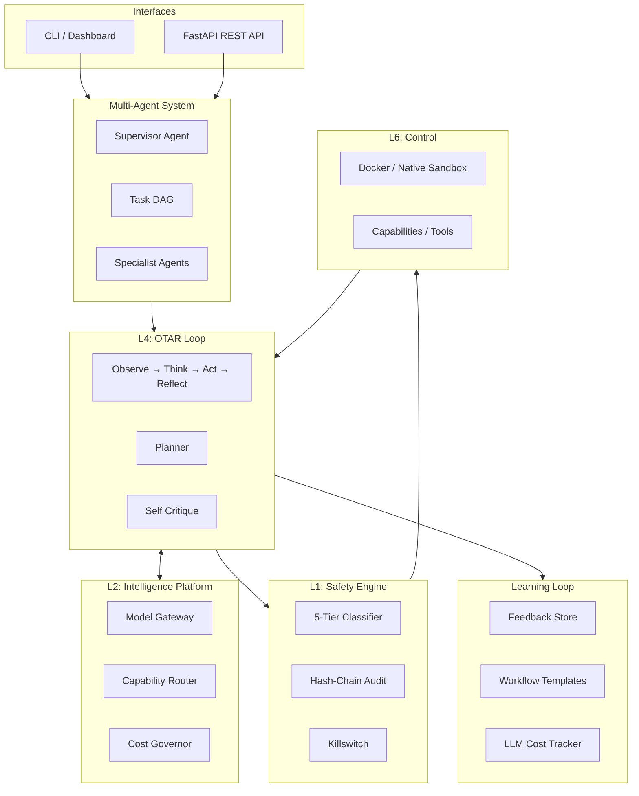

<div align="center">
  <br />
  
  <br />
  <h1>ATLAS</h1>
  <h3>Autonomous Task & Learning Agent System</h3>
  <br />
  <p>
    <a href="https://github.com/aman-bhaskar-codes/ATLAS/actions"></a>
    <a href="https://python.org"></a>
    <a href="https://github.com/astral-sh/uv"></a>
    <a href="https://github.com/astral-sh/ruff"></a>
    <a href="https://github.com/python/mypy"></a>
    <a href="LICENSE"></a>
  </p>
  <p>
    <em>A production-grade, local-first autonomous AI agent framework with uncompromising safety and auditability.</em>
  </p>
  <br />
</div>

<hr />

## 🌟 Overview

**ATLAS** is a ground-up implementation of a full autonomous agent stack. It is not just another LLM wrapper or chat framework; it is a multi-phase agentic runtime built for executing complex tasks across local and cloud environments while strictly adhering to user consent.

Nothing happens without your explicit permission. Every tool call flows through a rigorous Safety Engine with a 5-tier classification system and tamper-proof SHA-256 audit chain.

```text
Perception → Memory → Planning → OTAR Loop (Observe → Think → Act → Reflect) → Safety → Execution
```

---

## ✨ Core Capabilities

- **🛡️ 5-Tier Safety Engine**: "Deny-by-default" architecture. Every action is tier-classified (AUTO → NOTIFY → CONFIRM → DANGEROUS → BLOCK). DANGEROUS actions require a confirmation code. Tamper-proof SHA-256 hash chain on every audit entry.
- **🤖 Multi-Agent DAG System**: Complex tasks are decomposed by a Supervisor agent into a DAG of subtasks, each assigned to specialist agents (researcher, writer, coder, analyst). Independent subtasks execute in parallel.
- **🔌 Local-First & Cloud-Ready**: Prioritizes local, open-source models (via Ollama) to guarantee privacy, but can seamlessly scale up to reasoning models (DeepSeek, GLM, etc.) when authorized.
- **🧠 Advanced Four-Layer Memory**: Features Working (scratchpad), Episodic (event logs), Semantic (vector embeddings via ChromaDB), and User models. Automatically consolidates and prunes memories.
- **🔄 OTAR Reasoning Loop**: Observe → Think → Act → Reflect. Post-action reflection evaluates outcomes and extracts learnings to prevent repeating mistakes.
- **🔎 In-Loop Self-Critique**: Before any risky action is executed, the agent critiques its own plan in a fast, low-cost loop to catch mistakes or hallucinations early.
- **📊 Evaluation & Learning Loop**: Feedback store (thumbs up/down + edits), LLM cost tracking per-model/per-task, workflow templates learned from successful executions.
- **⏰ Cron Scheduler**: Recurring task execution with standard 5-field cron expressions.
- **📜 Fully Auditable**: Complete transparency. Every API call, reasoning chain, tool execution, and cost metric is logged with cryptographic integrity.
- **🏗️ Dependency Injected Core**: A beautifully layered architecture (`app.py` composition root) making testing, mocking, and extensions effortless.

---

## 🏗️ Architecture

ATLAS is rigorously structured into independently testable layers:



---

## 🚀 Quickstart

### Prerequisites
- [Python 3.13+](https://www.python.org/)
- [uv](https://docs.astral.sh/uv/) (Extremely fast Python package manager)
- [Ollama](https://ollama.ai/) (For local-first inference)

### 1. Installation

Clone the repository and install all dependencies:

```bash
git clone https://github.com/aman-bhaskar-codes/ATLAS.git
cd ATLAS
uv sync --all-extras
```

### 2. Configuration

Copy the example environment variables and configure your setup:

```bash
cp .env.example .env
```

Ensure Ollama is running (`OLLAMA_HOST=http://localhost:11434`), and optionally add any cloud API keys in `.env` if you've enabled cloud routing in your `config/settings.yaml`.

### 3. Run

Run the preflight health check to ensure all dependencies and databases are ready:

```bash
uv run atlas doctor
```

Dispatch a task to your autonomous agent:

```bash
uv run atlas run "research the latest papers on multi-agent systems and save the summary to research.md"
```

---

## 💻 Web Dashboard (Next.js)

ATLAS comes with a beautiful, real-time tracking dashboard to monitor agent reasoning, approvals, and memories.

1. In a new terminal, start the Next.js frontend:
   ```bash
   cd frontend
   npm install
   npm run dev
   ```
2. Start the FastAPI backend:
   ```bash
   uv run uvicorn atlas.interfaces.api.app:create_app --factory --host 127.0.0.1 --port 8730 --reload
   ```
3. Open [http://localhost:3000](http://localhost:3000) to view the live dashboard.

---

## 🧪 Testing

ATLAS maintains 100% type-strictness (`mypy --strict`) and high test coverage with zero mocked business logic.

```bash
# Full test suite
uv run pytest

# Linter and Type Checking
uv run ruff check .
uv run mypy
```

---

## 🗺️ Roadmap

- **Phase 1-5 (Complete):** Safety Engine, Orchestration, Memory, Intelligence Routing, Identity Platform.
- **Phase 6 (Complete):** 5-Tier Safety + Hash-Chain Audit, OTAR Reasoning, Multi-Agent DAG System.
- **Phase 7 (Complete):** Evaluation Loop, Feedback Store, LLM Tracker, Workflow Templates, Cron Scheduler.
- **Phase 8 (Next):** RAG Pipeline Integration, Earned Autonomy, Advanced Workflow Learning.

---

## 📜 License

This project is licensed under the **MIT License** — see the [LICENSE](LICENSE) file for details.

<br />
<div align="center">
  Built with ❤️ by <a href="https://github.com/aman-bhaskar-codes">Aman Bhaskar</a>
</div>
