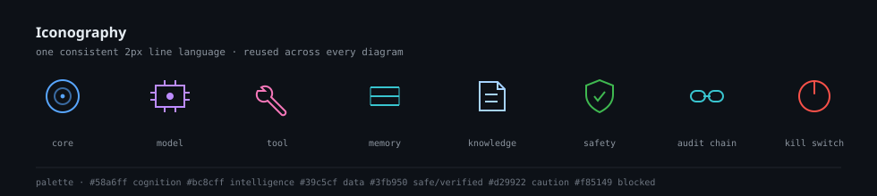
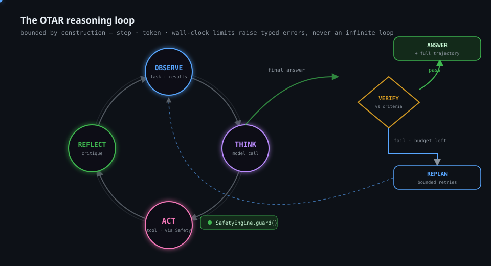
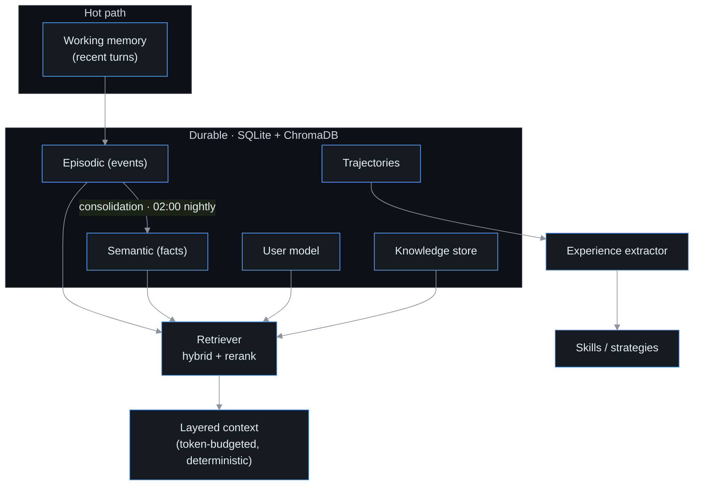
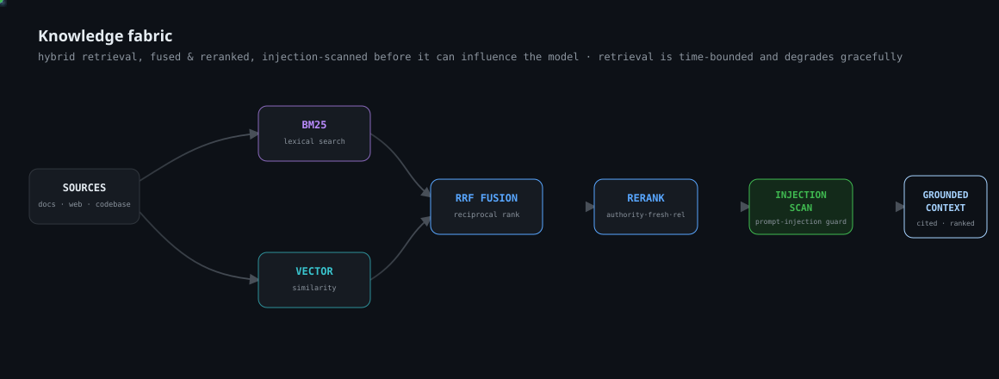
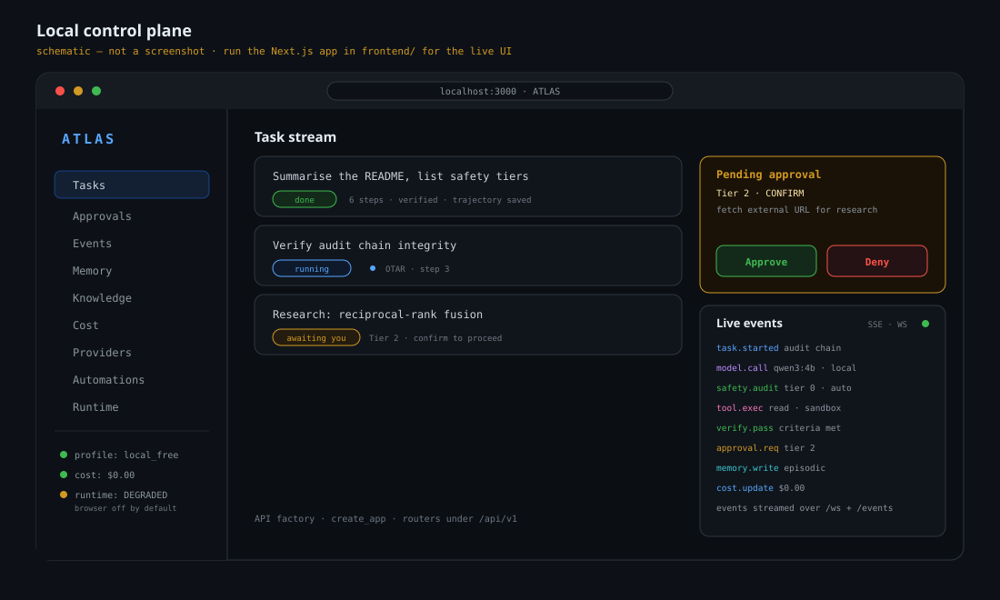
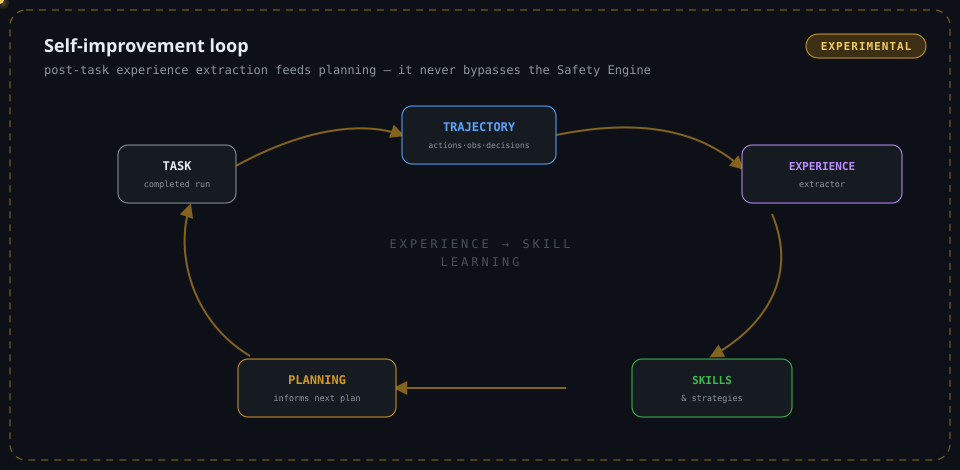

<!-- ─────────────────────────────────────────────────────────────────────────
     ATLAS · README
     Local-first, safety-governed autonomous agent runtime.
     Every claim below is verified against the current repository.
────────────────────────────────────────────────────────────────────────── -->

<p align="center">
  <picture>
    <source media="(prefers-reduced-motion: reduce)" srcset="assets/readme/hero/atlas-hero-static.svg" />
    
  </picture>
</p>

<h1 align="center">ATLAS</h1>

<p align="center">
  <strong>Autonomous Task &amp; Learning Agent System</strong><br/>
  A local-first, safety-governed agent runtime — <em>zero-cost by default, fully auditable, and yours to run.</em>
</p>

<p align="center">
  
  
  
  
  
  
  
</p>

<p align="center">
  <a href="#what-is-atlas">What</a> ·
  <a href="#why-atlas">Why</a> ·
  <a href="#capabilities">Capabilities</a> ·
  <a href="#living-architecture">Architecture</a> ·
  <a href="#how-atlas-works">How it works</a> ·
  <a href="#safety">Safety</a> ·
  <a href="#quick-start">Quick start</a> ·
  <a href="#configuration">Config</a> ·
  <a href="#current-status">Status</a>
</p>

<p align="center"></p>

## What is ATLAS

ATLAS is an **autonomous agent runtime** that runs on your own machine. You give it a task in natural language; it *understands* the intent, *plans* an approach, then executes a **bounded reasoning loop** — thinking, calling tools, observing results, and reflecting — until it produces a verified answer or safely stops.

Three properties define it:

- **Local-first.** The default profile runs entirely on a local model (Ollama · `qwen3:4b`) with **$0** budgets and no network egress. Cloud models are strictly opt-in.
- **Safety-governed.** No tool ever executes except through a reference-monitor **Safety Engine**: every action is classified into a risk tier, checked against policy, and written to a tamper-evident audit log *before* it runs.
- **Auditable & single-user.** One person, one runtime. Every decision, cost, and side-effect is recorded in an append-only, hash-chained ledger you can verify at any time.

> ATLAS is a **single-orchestrator** system built around one composition root (`atlas.app.build()`). It is engineered for correctness and traceability, not scale — it is meant to be run locally by the person who owns it.

## Why ATLAS

Most agent frameworks optimise for capability first and ask questions about trust later. ATLAS inverts that. Its design principles are enforced in code and in CI, not just documented:

| Principle | What it means in practice | Where it lives |
| :-- | :-- | :-- |
| **The model proposes, ATLAS decides** | The LLM never executes anything directly — it emits a proposed action that the Safety Engine independently classifies and gates. | `safety/engine.py`, `orchestration/dispatcher.py` |
| **Deny-by-default** | Consequential actions require explicit confirmation; high-impact actions require a one-time code; some categories are hard-blocked. | `config/permissions.yaml` |
| **Everything is auditable** | Every decision is appended to a SHA-256 hash-chained log that doubles as the single source of truth for cost. | `safety/audit.py` |
| **Zero-cost first** | The model selector filters by cost class *before* ranking; a zero-cost profile can never resolve a paid model. | `config/models.yaml`, `infra/profiles.py` |
| **Bounded by construction** | The reasoning loop has hard step, token, and time limits; it degrades to a graceful failure rather than running forever. | `orchestration/reasoning.py`, `orchestration/limits.py` |
| **Enforced layering** | Architectural boundaries are checked by import-linter in CI — infrastructure may never import higher layers. | `importlinter.ini` |

<p align="center"></p>

## Capabilities

Status legend — **✅ Stable** (wired into the runtime & covered by tests) · **⚠️ Partial / opt-in** · **🧪 Experimental** · **🛠 Planned (present in code, not wired)**.

| Capability | Status | Summary |
| :-- | :--: | :-- |
| **Bounded OTAR reasoning** | ✅ | Observe → Think → Act → Reflect loop with verification and bounded replanning. |
| **Safety engine (5 tiers)** | ✅ | Every tool call classified, policy-checked, audited, and sandboxed before execution. |
| **Hash-chained audit + cost ledger** | ✅ | Append-only SHA-256 chain; verifiable at any time; single source of truth for spend. |
| **Zero-cost model gateway** | ✅ | Cost-class-aware selection across local + free cloud models; policy-enforced budgets. |
| **Layered memory** | ✅ | Working, episodic, semantic, user-model & knowledge stores over SQLite + ChromaDB. |
| **Knowledge fabric** | ✅ | Hybrid retrieval (BM25 + reciprocal-rank fusion), feature reranking, query routing, prompt-injection scanning. |
| **Filesystem & shell tools** | ✅ | Path- and command-scoped, sandboxed, tier-gated. |
| **Autonomy (triggers, automations, cron)** | ✅ | Event- and schedule-driven task creation; nightly memory consolidation. |
| **HTTP API + Web dashboard** | ✅ | FastAPI control plane (`:8730`) with SSE + WebSocket streaming; Next.js 16 UI. |
| **Trajectory capture & evaluation gate** | ✅ | Full execution traces recorded; a recorded-answer regression gate runs in CI. |
| **Experience → skill/strategy learning** | 🧪 | Post-task experience extraction feeds skills that can inform future planning. |
| **Computer use / browser** | ⚠️ | Registered and safety-gated, but **opt-in** — disabled by default (runtime boots `DEGRADED`). |
| **Public-API connectors** | 🧪 | Discovered-only, safety-gated integrations. |
| **Multi-agent specialists** | 🛠 | The `agents/` package exists in the codebase but is **not wired** into the runtime. |

<p align="center"></p>

## Living Architecture

ATLAS is a strictly layered system. Dependencies point **downward only** — a rule that import-linter enforces on every CI run (`"top may import lower; never the reverse"`).

<p align="center">
  
</p>

**Composition root.** A single call, `atlas.app.build()`, wires the entire system and returns one `Atlas` object. Startup is phased by a `RuntimeSupervisor` (`bootstrap → infrastructure → safety → intelligence → memory → capabilities → orchestration → readiness`); non-critical subsystems degrade gracefully, so a missing browser or knowledge backend never blocks boot.

<details>
<summary><strong>Repository layout</strong></summary>

```text
atlas/
├── src/
│   ├── atlas/
│   │   ├── app.py              # composition root — build() wires everything
│   │   ├── bootstrap/          # RuntimeSupervisor, phased startup
│   │   ├── orchestration/      # Orchestrator, OTAR loop, planner, dispatcher
│   │   ├── safety/             # engine, classifier, policy, audit, killswitch, sandbox
│   │   ├── intelligence/       # model gateway, selector, provider adapters
│   │   ├── memory/             # working/episodic/semantic/user-model + retrieval
│   │   ├── knowledge/          # BM25, reranking, router, injection scan
│   │   ├── capabilities/       # email/calendar/contacts/weather/location/…
│   │   ├── autonomy/           # trigger engine, automations, scheduler
│   │   ├── tools/              # filesystem, shell, computer_use
│   │   ├── interfaces/api/     # FastAPI app, routers, SSE/WebSocket
│   │   └── infra/              # db, bus, config, clock, audit types, migrations
│   └── atlas_cli/              # `atlas` command-line interface
├── config/                     # models.yaml · settings.yaml · permissions.yaml
├── frontend/                   # Next.js 16 + React 19 control-plane dashboard
├── benchmarks/                 # hot-path p50/p95/p99 harness
├── eval/                       # recorded answers for the CI regression gate
├── tests/                      # ~790 test functions across 124 files
└── .github/workflows/ci.yml    # lint · types · import boundaries · tests · eval gate
```
</details>

<details>
<summary><strong>Visual language</strong></summary>

<p align="center">
  
</p>
</details>

<p align="center"></p>

## How ATLAS Works

Every transport — CLI, HTTP API, Web UI — funnels into the same orchestrator pipeline. Nothing takes shortcuts.

```mermaid
%%{init: {'theme':'base','themeVariables':{'primaryColor':'#161b22','primaryTextColor':'#e6edf3','primaryBorderColor':'#58a6ff','lineColor':'#8b949e','fontFamily':'ui-monospace, monospace'}}}%%
sequenceDiagram
    actor U as You
    participant API as API / CLI
    participant ORCH as Orchestrator
    participant CTX as Memory + Context
    participant PLAN as Planner
    participant LOOP as OTAR Loop
    participant SAFE as Safety Engine
    participant TOOL as Tool
    U->>API: submit task
    API->>ORCH: run(event)
    ORCH->>ORCH: understand intent (once)
    ORCH->>CTX: build layered, token-budgeted context
    ORCH->>PLAN: plan(goal)
    ORCH->>LOOP: run(plan)
    loop until final answer or limit
        LOOP->>LOOP: Observe → Think (model)
        LOOP->>SAFE: dispatch proposed action
        SAFE->>TOOL: execute (only if allowed)
        TOOL-->>LOOP: observation
        LOOP->>LOOP: Reflect · verify · maybe replan
    end
    LOOP-->>ORCH: verified result + trajectory
    ORCH-->>API: TaskResult
    API-->>U: result + live events (SSE / WebSocket)
```

### The OTAR loop

The reasoning loop is the heart of the runtime, and it **cannot run forever** — step, token, and wall-clock limits raise typed errors that the monitor turns into a graceful failure. Consequential actions are critiqued *before* dispatch; outcomes are reflected on *after*.

<p align="center">
  
</p>

<p align="center"></p>

## Safety

Safety is not a wrapper around ATLAS — it is the path everything travels through. The `dispatcher` never touches a tool directly; it calls `SafetyEngine.guard()`, whose funnel is fixed:

<p align="center">
  
</p>

### Risk tiers

ATLAS classifies every action into one of five tiers (the "Vamos" model, `config/permissions.yaml`):

| Tier | Label | Behaviour |
| :--: | :-- | :-- |
| **0** | `AUTO` | Read-only, no side effects — auto-approved, logged silently. |
| **1** | `NOTIFY` | Reversible side effects — auto-approved with a notification. |
| **2** | `CONFIRM` | Irreversible or external — requires explicit user approval. |
| **3** | `DANGEROUS` | High-impact (delete data, spend money, touch credentials) — approval **plus a one-time confirmation code**. |
| **4** | `BLOCK` | Hard-blocked — never executed. |

**Hard-blocked categories** (never run, regardless of approval): credential access, financial transactions, mass deletion (default threshold 25 items), and edits to the safety config itself.

### Guarantees

- **Tamper-evident audit.** Each record hashes `SHA-256(prev_hash + action + payload + timestamp)`. Altering any historical row breaks the chain; `verify_chain()` (and `atlas doctor --verify-manifest`) walks the log and reports the first tampered entry.
- **Secrets never leak.** Payloads are deep-scrubbed before they are logged or streamed — known secret fields are redacted and token-shaped strings (`Bearer …`, `sk-…`, `ghp_…`, JWTs) are pattern-matched out. Master keys live in the OS keychain, never in the repo.
- **Sandboxed execution.** Tools run in a resource-capped sandbox (Docker `python:3.13-slim`, 1 CPU, 512 MB, PID-limited), falling back to a native sandbox in development.
- **Kill switch.** A filesystem stop-flag halts execution immediately — and it is **re-checked after any human confirmation**, because the world can change while a prompt waits.

<p align="center"></p>

## Intelligence & Cost

ATLAS treats model choice as a policy decision. The gateway filters candidates by **cost class** (`local` · `free` · `free_quota` · `paid`) *before* ranking them — so a zero-cost profile physically cannot resolve a paid model, even if an API key is present.

| Profile | Cost policy | Network | Model classes | Budget |
| :-- | :-- | :-- | :-- | :-- |
| **`local_free`** *(default)* | `zero_cost` | `local_only` | local | **$0** |
| `free_hybrid` | `free_only` | `free_cloud` | local · free · free-quota | $0 |
| `free_demo` | `free_preferred` | `free_cloud` | + small paid ceiling | $0.50 / day |
| `production` | `balanced` | `unrestricted` | + paid | $5 / day |

Select a profile with `ATLAS_PROFILE`, or tune tiers (`fast_models` / `deep_models` / `fallback_models`) in `config/settings.yaml` without touching code. Out of the box, the default local model is **`qwen3:4b`** via Ollama; several free-tier OpenRouter models are pre-registered and used only when a profile permits cloud access.

<p align="center"></p>

## Memory

Memory is layered by lifetime and authority. Recent turns live in working memory; durable knowledge is persisted to SQLite + ChromaDB and consolidated on a nightly schedule.



The **context builder** assembles a deterministic, priority-ordered prompt (`system → safety → user-model → tools → memory → working`) under a hard token budget, trimming only the most negotiable layers. Retrieval is time-bounded: if the vector store hiccups, the task proceeds with the layers it always has rather than stalling.

## Knowledge & Research

<p align="center">
  
</p>

The knowledge fabric turns documents into grounded, ranked context:

- **Hybrid retrieval** — BM25 lexical search fused with vector similarity via reciprocal-rank fusion.
- **Feature reranking** — candidates re-scored on authority, freshness, and relevance features.
- **Query routing** — multi-hop questions decomposed and routed.
- **Injection scanning** — retrieved content is scanned for prompt-injection before it can influence the model.

Every CPU leg of this path is tracked by the benchmark harness (see [Evaluation and Performance](#evaluation-and-performance)); the whole fabric degrades gracefully — if it fails to initialise, the runtime continues without it.

## Perception & Computer Use ⚠️

A `computer_use` tool is registered and fully safety-gated. Browser-driven perception is **opt-in and disabled by default** — the runtime deliberately boots into a `DEGRADED` state with the browser off, and you enable it explicitly. As with every tool, actions here are tier-classified and audited; nothing bypasses the Safety Engine.

<p align="center"></p>

## Quick Start

**Prerequisites:** Python 3.13 · [uv](https://docs.astral.sh/uv/) · [Ollama](https://ollama.com) (local model) · Node 20+ (optional, for the Web UI) · Docker (optional, for the container sandbox).

```bash
# 1 · Clone
git clone https://github.com/aman-bhaskar-codes/ATLAS.git
cd ATLAS

# 2 · Install dependencies (creates the virtualenv)
uv sync

# 3 · Pull the default local models (zero-cost, offline)
ollama pull qwen3:4b      # default reasoning model
ollama pull bge-m3        # embeddings

# 4 · Configure
cp .env.example .env      # defaults are local-first + $0

# 5 · Verify the install
uv run atlas doctor
```

**Run a task from the CLI:**

```bash
uv run atlas run "Summarise the README and list the safety tiers"
```

**Start the API + control plane:**

```bash
uv run uvicorn atlas.interfaces.api.app:create_app --factory \
  --host 127.0.0.1 --port 8730 --reload
# API docs → http://127.0.0.1:8730/api/docs
```

**(Optional) launch the Web dashboard:**

```bash
cd frontend && npm install && npm run dev   # → http://localhost:3000
```

<p align="center">
  
</p>
<p align="center"><sub>Schematic of the local control plane — the panels map to real API routers; run <code>frontend/</code> for the live UI.</sub></p>

> If you use [`just`](https://github.com/casey/just): `just serve` runs the API and `just check` runs the full quality gate.

<p align="center"></p>

## Configuration

ATLAS reads layered configuration from `config/` with environment overrides. All environment variables are `ATLAS_`-prefixed.

| Variable | Purpose | Default |
| :-- | :-- | :-- |
| `ATLAS_PROFILE` | Operating profile | `local_free` |
| `ATLAS_COST_POLICY` | `zero_cost` … `unrestricted` | `zero_cost` |
| `ATLAS_NETWORK_POLICY` | `offline` … `unrestricted` | `local_only` |
| `ATLAS_DEFAULT_MODEL` | Local reasoning model | `qwen3:4b` |
| `ATLAS_EMBED_MODEL` | Embedding model | `bge-m3` |
| `ATLAS_OLLAMA_HOST` | Ollama endpoint | `http://localhost:11434` |
| `ATLAS_MASTER_KEY` | Secrets key (OS keychain `atlas-master`) | — |

<details>
<summary><strong>Config files</strong></summary>

- **`config/models.yaml`** — the model registry. Every entry declares a `cost_class`; the selector enforces cost/network policy against it.
- **`config/settings.yaml`** — profiles, inference tiers, budgets, sandbox limits, critique/verification switches.
- **`config/permissions.yaml`** — the five-tier permission model, per-tool rules, hard-block categories, and thresholds.
- Cloud provider keys (e.g. `ATLAS_GROQ_API_KEY`, `ATLAS_GEMINI_API_KEY`, `ATLAS_OPENROUTER_API_KEY`) are only consulted when a profile permits cloud access.
</details>

## Command-Line Interface

`atlas` is the primary control surface. Run `uv run atlas --help` for the full tree.

| Command | Purpose |
| :-- | :-- |
| `atlas run "<task>"` | Execute a task through the full pipeline. |
| `atlas doctor` | Health & manifest verification (`--verify-manifest`). |
| `atlas events` | Stream live runtime events. |
| `atlas providers list \| free \| health \| verify` | Inspect model providers. |
| `atlas models list \| doctor` | Inspect the model registry. |
| `atlas cost show \| enforce <mode>` | View spend or set the cost policy. |
| `atlas memory consolidate \| promote` | Run memory maintenance. |
| `atlas automations list \| create \| toggle` | Manage autonomous triggers. |
| `atlas profile` | Show the active operating profile. |
| `atlas runtime …` | Runtime supervisor controls. |

<details>
<summary><strong>HTTP API surface</strong></summary>

The FastAPI app (factory `atlas.interfaces.api.app:create_app`) mounts routers mostly under `/api/v1`, with interactive docs at `/api/docs` and OpenAPI at `/api/openapi.json`. Routers include: **health, runtime, tasks, approvals, capabilities, feedback, knowledge, memory, trajectory, attachments, trust, events, learning, ops, providers, automations**, plus a WebSocket endpoint under `/ws`. CORS is restricted to the local dev origin and requests are rate-limited (120 burst / 60 per minute).
</details>

<p align="center"></p>

## Evaluation and Performance

**Self-improvement.** Completed tasks produce full **trajectories** (actions, observations, decisions). A post-task **experience extractor** distils lessons into skills and strategies that can inform future planning *(experimental)*.

<p align="center">
  
</p>

**Regression gate.** CI replays recorded answers through an evaluation gate (`scripts/eval_gate.py`) so behavioural regressions fail the build.

**Performance harness.** `uv run python benchmarks/run.py` measures **p50 / p95 / p99** latency for 13 deterministic hot-path stages — plan parsing, context compaction, tool routing, model-selection ranking, grounding verification, and the knowledge fabric's BM25 build/query, query routing, reranking, and injection scan — appending results to `benchmarks/report.json` so trends stay comparable over time. *(Run it locally for numbers on your hardware; no figures are hard-coded here.)*

**Quality gate** (enforced on every push via `.github/workflows/ci.yml`):

| Gate | Tool |
| :-- | :-- |
| Lint | `ruff check .` |
| Types | `mypy` (strict) |
| Import boundaries | `lint-imports` |
| Tests + global coverage floor | `pytest --cov` (≥ 63%) |
| Safety coverage floor | ≥ 70% |
| Orchestration coverage floor | ≥ 83% |
| Evaluation regression | `scripts/eval_gate.py` |

The test suite is roughly **790 test functions across 124 files**, and `pre-commit` mirrors the lint/type/import gates locally.

<p align="center"></p>

## Extending ATLAS

- **Add a model** — append an entry to `config/models.yaml` with its `cost_class`; the gateway picks it up under the matching profile. No code change.
- **Retune inference tiers** — edit `fast_models` / `deep_models` / `fallback_models` in `config/settings.yaml`.
- **Add a tool** — implement the `Tool` interface (`dry_run` + `execute`), register it in the composition root, and declare its permissions in `config/permissions.yaml`. It is automatically routed through the Safety Engine.
- **Respect the layers** — infrastructure must not import safety, tools, interfaces, memory, or intelligence; provider adapters stay isolated. `lint-imports` will reject violations.

## Current Status

ATLAS is actively developed and honest about its maturity. The core runtime — orchestration, safety, audit, memory, model gateway, CLI, and API — is wired end-to-end and covered by the CI gates above. Some capabilities are intentionally opt-in or experimental:

| Area | Reality |
| :-- | :-- |
| Core runtime (orchestrator, safety, audit, memory, gateway, CLI, API) | ✅ Wired & tested. |
| Web dashboard (Next.js 16) | ✅ Local control plane; treat as a developer UI. |
| Browser / computer use | ⚠️ Opt-in; off by default (runtime boots `DEGRADED`). |
| Experience → skill learning | 🧪 Wired but experimental. |
| Public-API connectors | 🧪 Discovered-only, safety-gated. |
| Multi-agent specialists (`agents/`) | 🛠 Present in the codebase, **not integrated** into the runtime. |

> **On the `agents/` package:** it contains scaffolding for a specialist/supervisor model that is **not** part of the running system today. ATLAS ships as a single-orchestrator runtime; treat multi-agent execution as planned, not delivered.

## Roadmap

- Integrate the specialist layer behind the single orchestrator (with the same safety funnel).
- Expand computer-use perception beyond opt-in browsing.
- Broaden the evaluation corpus and publish reproducible benchmark baselines.
- Harden and document the public-API connector framework.

## Contributing

1. `uv sync` and enable hooks: `uv run pre-commit install`.
2. Make your change; keep it inside its architectural layer.
3. Run the gate locally: `just check` (or the individual `ruff` / `mypy` / `lint-imports` / `pytest` commands).
4. Open a pull request — CI runs the same gate, including the coverage floors and evaluation regression.

## License

Released under the **MIT License** — © 2026 Aman Bhaskar. See [`LICENSE`](LICENSE).

<p align="center"></p>

<p align="center">
  <sub>Built to be run by the person who owns it — local-first, safety-governed, and fully auditable.</sub>
</p>
